# 2. Web Security

In questo modulo viene trattata la sicurezza web e in particolare i vari attacchi che è possibile effettuare all'interno di pagine web come social network e siti gestionali.

## 2.1 Cookies (CSRF)

Non appena entriamo nel sito www.example32.com, vengono mostrati tutti i cookie e i loro attributi

<p align="center">
  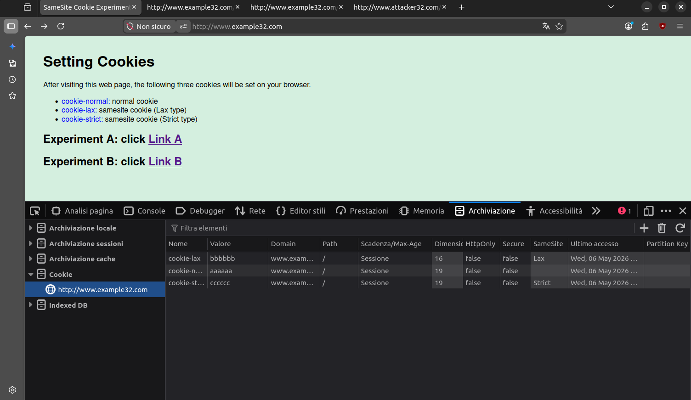
</p>


vengono definiti 3 tipi di cookies:
- Cookie normali: cookies che non hanno nessuna tipologia di restrizione
- Cookie lax: possono essere inviati in qualsiasi contesto, tranne in quello cross-site
- Cookie strict: non possono essere inviati in nessun contesto cross-site

Vengono definiti 2 scenari:
- Richiesta GET di una pagina web
- Invio di un form mediante POST

### SameSite Cookies

Sia la richiesta get che quella post all'interno dello stesso sito possono sfruttare tutti e tre le tipologie di cookie

<table align="center">
  <tr>
    <td align="center">
      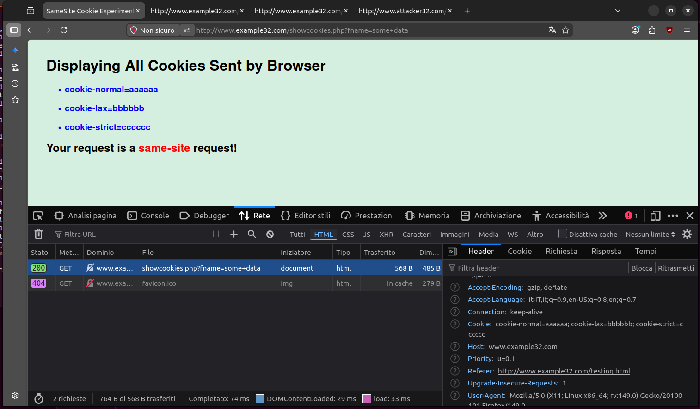
      <br>
      <b>Same-Site GET</b>
    </td>
    <td align="center">
      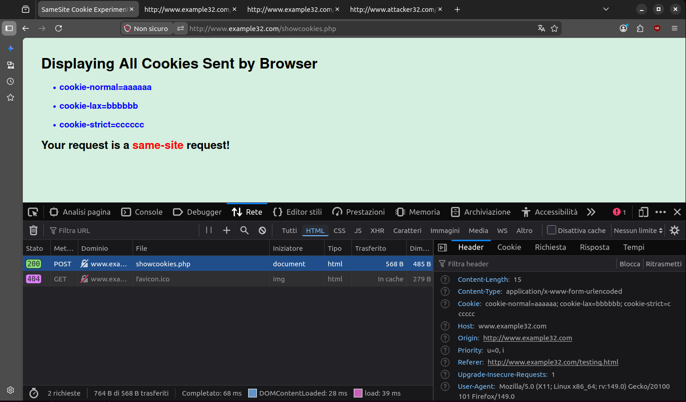
      <br>
      <b>Same-Site POST</b>
    </td>
  </tr>
</table>

### Cross-Site Request

Per quanto riguarda la richiesta cross-site, i cookie normali e lax possono essere inviati in richieste di tipo get. In richieste di tipo post, solamente i cookie normali vengono inviati.
I cookie strict non vengono inviati in nessuno dei due scenari.
Questo perché vengono applicate le restrizioni del parametro SameSite.

<table align="center">
  <tr>
    <td align="center">
      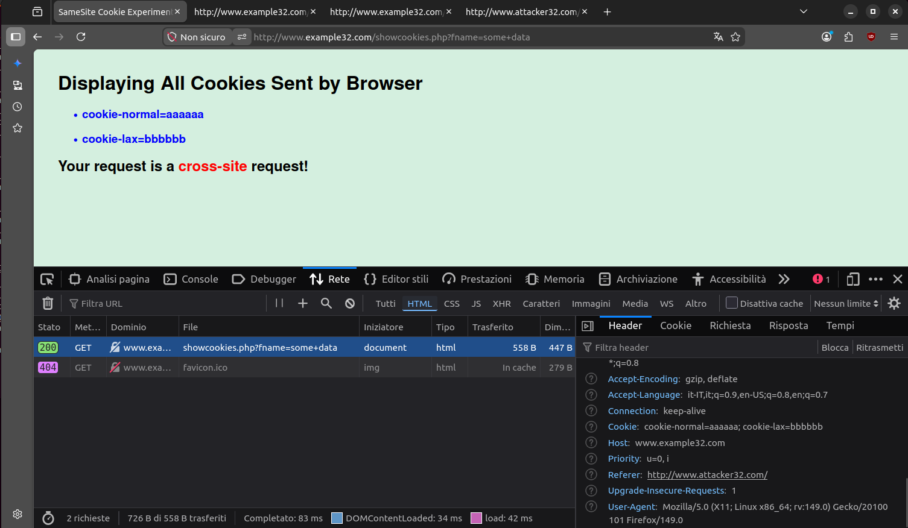
      <br>
      <b>Cross-Site GET</b>
    </td>
    <td align="center">
      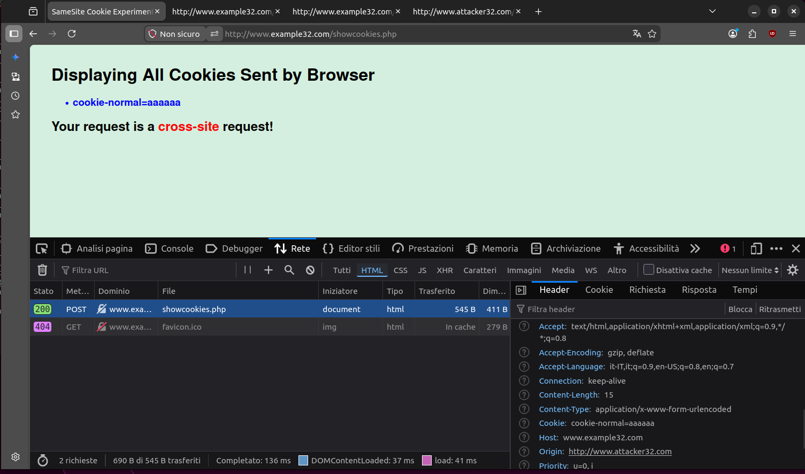
      <br>
      <b>Cross-Site POST</b>
    </td>
  </tr>
</table>


## 2.2 XSS (Cross-Site Scripting)

Per il cross-site scripting (XSS) viene utilizzato un social network fittizio chiamato Elgg, dove sono presenti delle meccaniche di profilo e di amicizia. Tramite l'uso della descrizione del profilo, è possibile sferrare degli attacchi XSS di tipo persistente all'interno del sito. 

Di default, le descrizioni dei profili sono vuote.

<p align="center">
  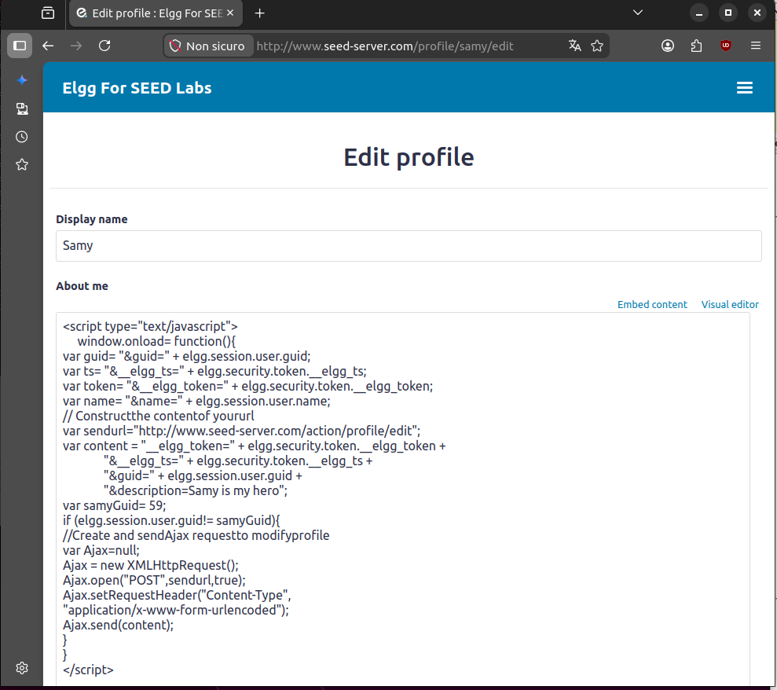
</p>

Questo è reso possibile a causa dell'assenza di filtraggio all'interno dei campi di testo all'interno del sito.

### 2.2.1 Stored XSS Attack on POST Request

L'obiettivo finale è quello di far apparire all'interno della descrizione del profilo dell'utente vittima la scritta "Samy is my hero" tramite l'uso di JavaScript. 

Viene usato un profilo apposito chiamato Samy.

Il primo step consiste nell'intercettare una richiesta POST per la modifica della descrizione del profilo, questo al fine di poter 
- Analizzare il formato della form per inserire all'interno del payload
- Individuare il link a cui fare la richiesta

Per fare questo, viene utilizzato Wireshark per analizzare il traffico di rete, focalizzandoci sulle richieste e risposte di tipo HTTP.

<p align="center">
  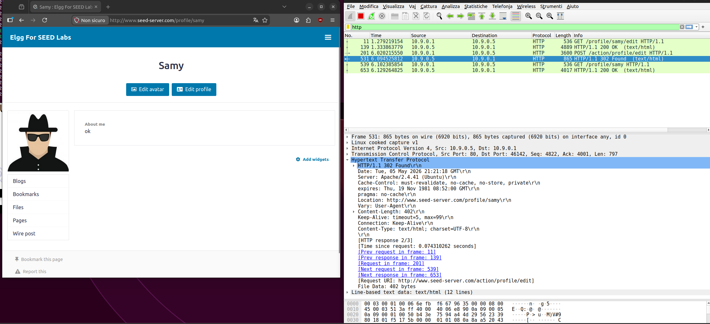
</p>

Da questo possiamo notare l'uso di vari campi, tra cui:

- __elgg_ts: timestamp
- __elgg_token: 
- guid: user id
- description: l'effettiva descrizione del profilo dove va inserito il campo di testo

Come meccanismo di sicurezza, inoltre, cerchiamo anche di ricavarci il nostro user id, in modo da inserire il payload in altri profili al di fuori del soggetto che esegue l'attacco.

Per scoprire lo user id, usiamo un secondo account e intercettiamo la richiesta di amicizia verso Samy. Da qui si può estrarre lo user ID

<p align="center">
  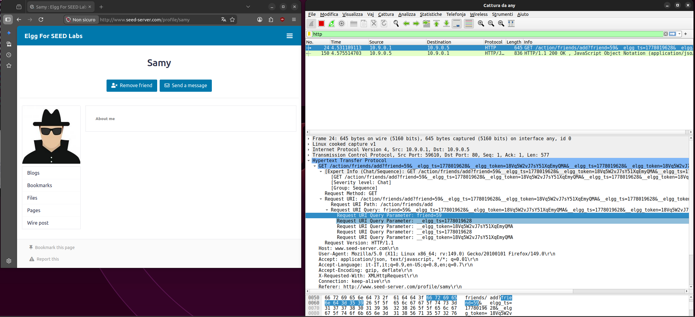
</p>

Una volta compilati tutti i campi, la richiesta XMLHttpRequest è pronta e può essere inserita all'interno del profilo.

lo script è contenuto in `script1.html`

Visitando il profilo di Samy con il profilo precedentemente utilizzato, possiamo notare mediante l'uso di Wireshark che, oltre alla richiesta GET per recuperare le informazioni del profilo, viene effettuata una richiesta POST per recuperare i commenti.

<p align="center">
  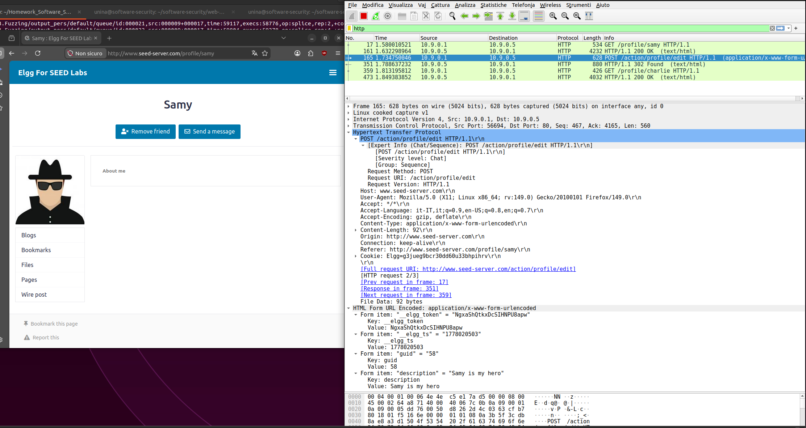
</p>

Visitando il nostro profilo, possiamo notare che la descrizione è stata modificata con successo

<p align="center">
  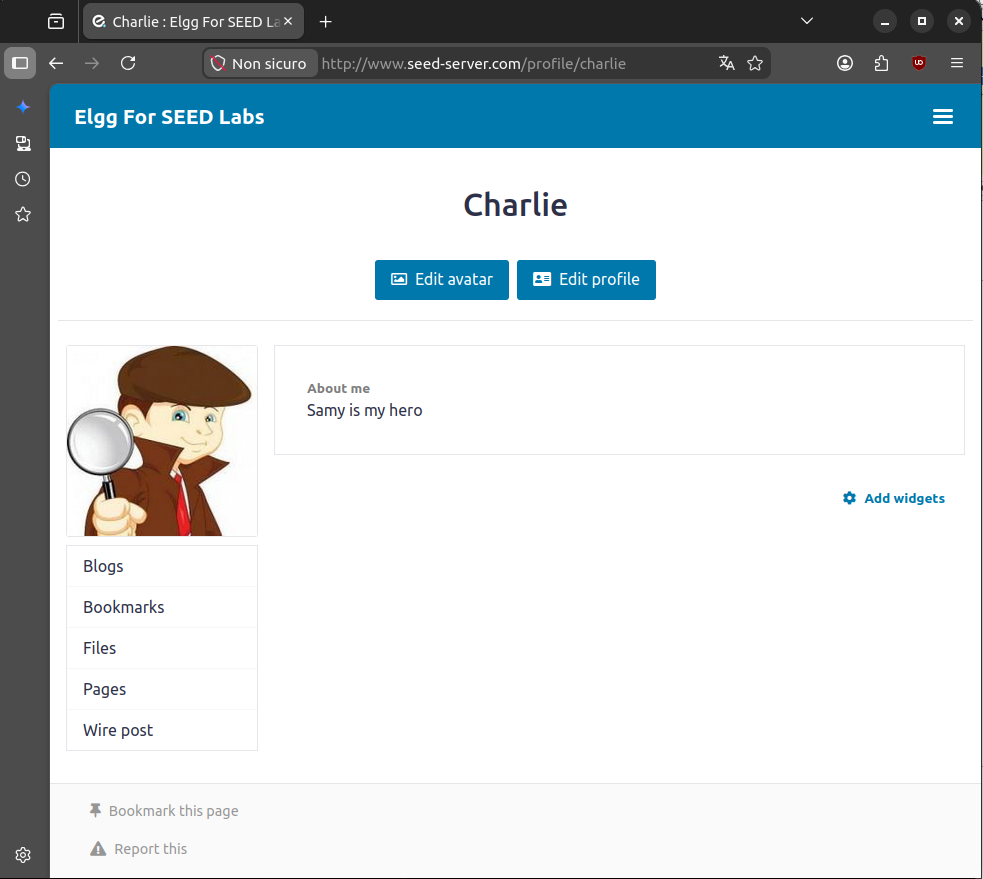
</p>

### 2.2.2 Self-Propagating XSS Worm

Rispetto al punto precedente, adesso l'obiettivo è quello di fare in modo che l'attacco si autopropaghi anche ad altri utenti. Per fare questo, possiamo fare in modo che il nostro script abbia un ID e venga inserito in sé stesso tramite la funzione `getElementById` e codificato tramite `encodeURIComponent`.

```javascript
        //self-propagation  
        var headerTag = "<script id=\"worm\" type=\"text/javascript\">";
        var jsCode = document.getElementById("worm").innerHTML;
        var tailTag = "</" + "script>";

        // Put all the pieces together, and apply the URI encoding
        var wormCode = encodeURIComponent(headerTag + jsCode + tailTag);

        // Set the content of the descriptionfieldand accesslevel
        var desc = "&description=Samyismyhero" + wormCode;
        desc += "&accesslevel[description]=2";
```

il resto è identico al punto precedente, se non ché viene inserita la variabile `desc` all'interno della campo contenente la descrizione del profilo.

Possiamo provare effettuando dapprima un accesso con un altro profilo(Alice), visitando Samy

<table align="center">
  <tr>
    <td align="center">
      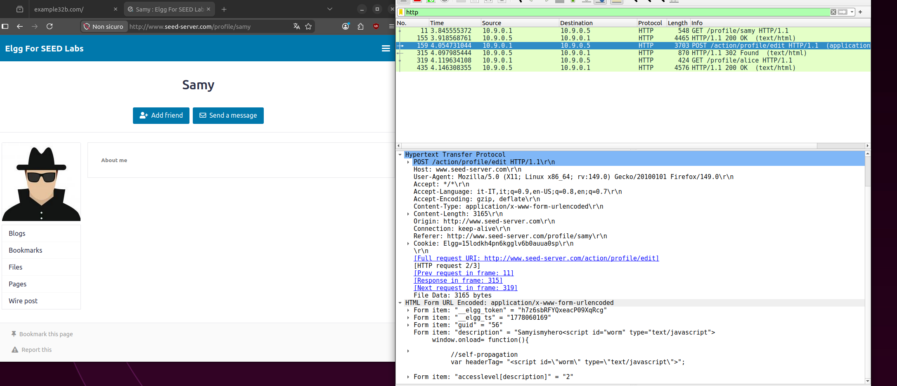
      <br>
      <b>Richiesta POST (Alice -> Samy)</b>
    </td>
    <td align="center">
      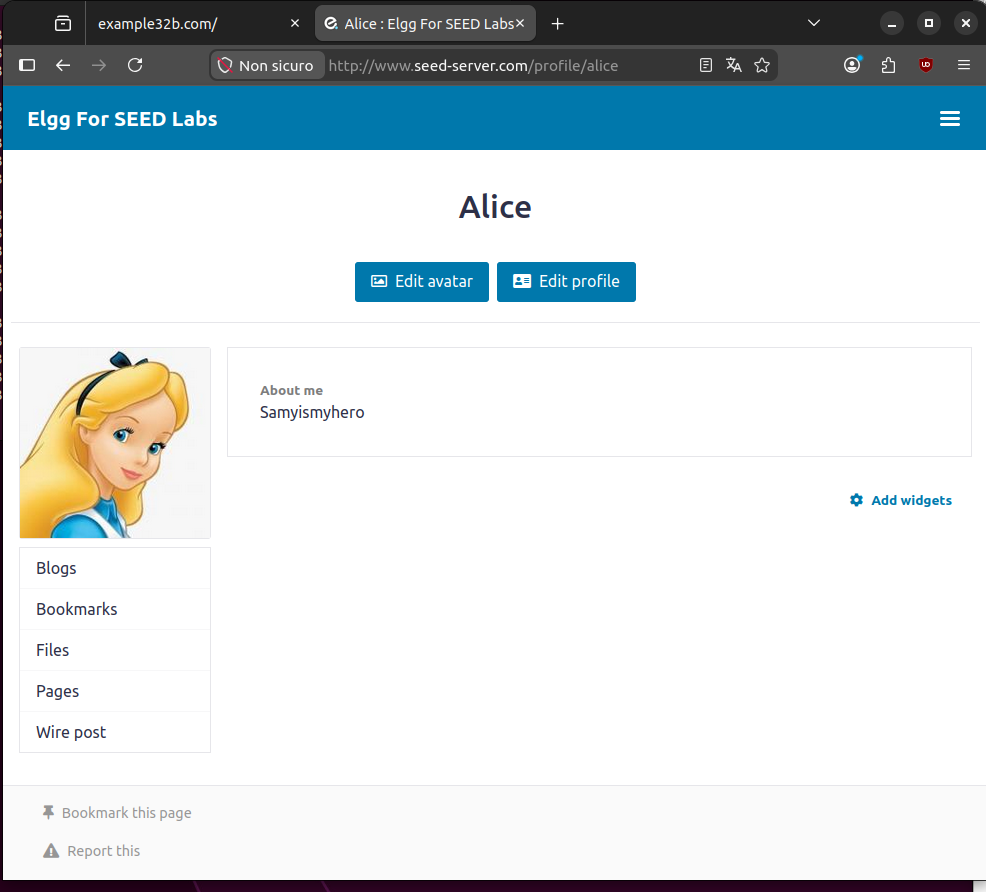
      <br>
      <b>Profilo Infetto (Alice)</b>
    </td>
  </tr>
</table>

e poi con un altro profilo ancora(Boby), visitando Alice

<table align="center">
  <tr>
    <td align="center">
      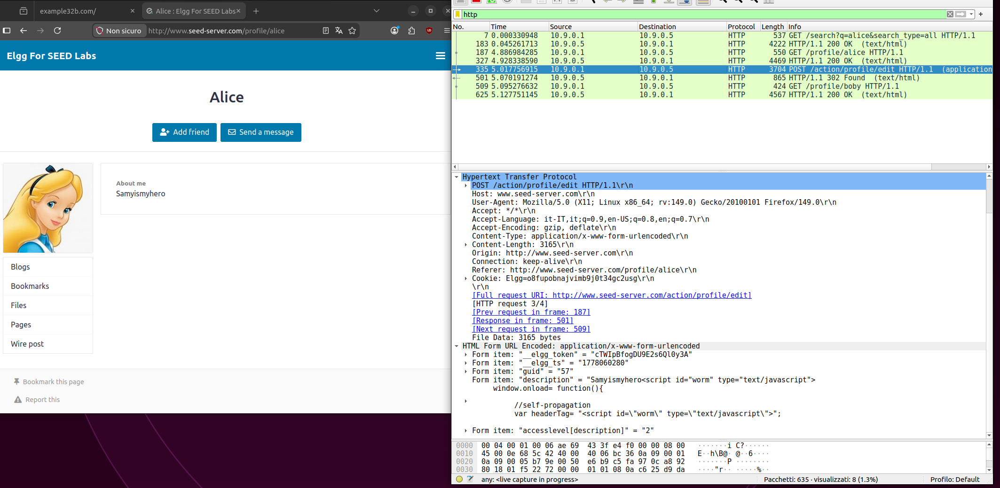
      <br>
      <b>Richiesta POST (Boby -> Alice)</b>
    </td>
    <td align="center">
      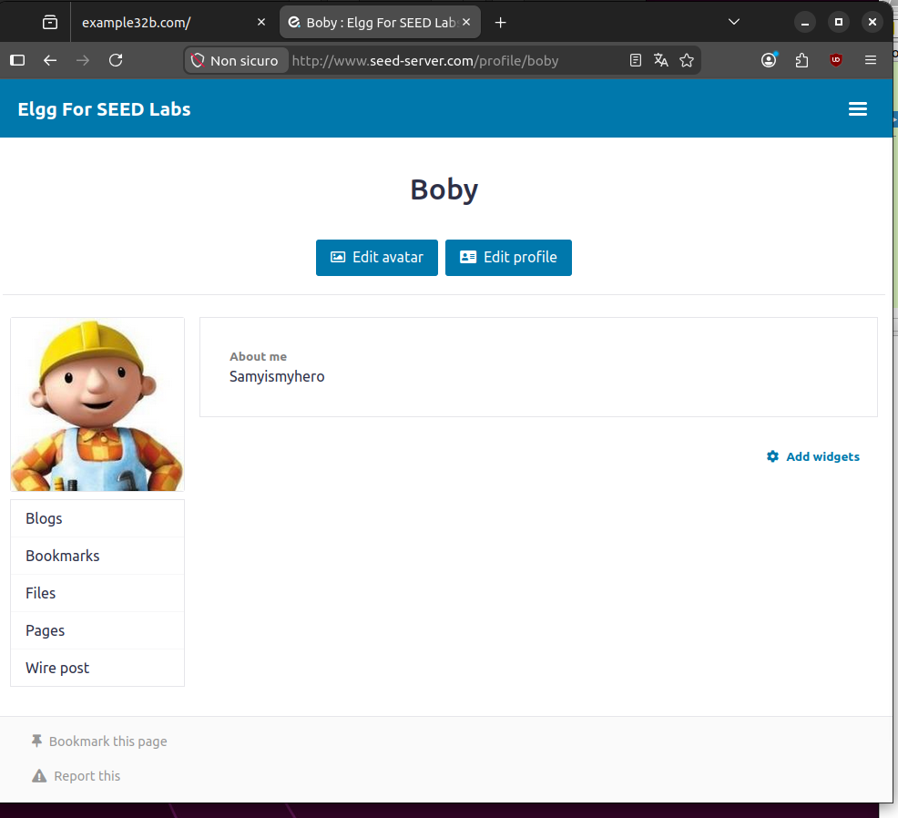
      <br>
      <b>Profilo Infetto (Boby)</b>
    </td>
  </tr>
</table>

### 2.2.3 Content-Security-Policy

Al fine di evitare l'esecuzione di script arbitrari, è possibile utilizzare la Content Security Policy (CSP), un livello di sicurezza aggiuntivo che aiuta a rilevare e mitigare alcuni tipi di attacchi, tra cui XSS.

Di seguito vengono analizzati due scenari di configurazione:

#### Scenario 1: Configurazione tramite Apache (example32b)
In questo scenario, la policy viene definita direttamente nel file di configurazione di Apache (`apache_csp_example32.conf`). È stata utilizzata la direttiva `unsafe-inline` all'interno di `script-src`, che permette l'esecuzione di script inline nel sito.

<table align="center">
  <tr>
    <td align="center">
      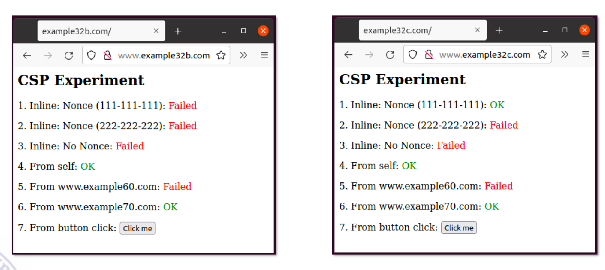
      <br>
      <b>Prima dell'applicazione CSP</b>
    </td>
    <td align="center">
      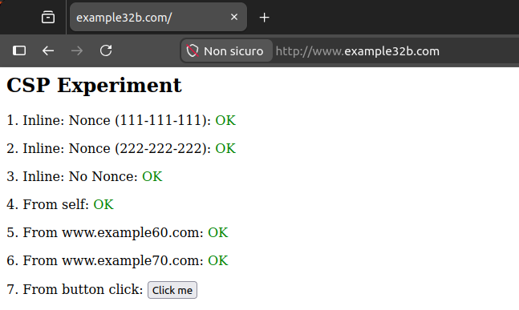
      <br>
      <b>Dopo (example32b - unsafe-inline)</b>
    </td>
  </tr>
</table>

#### Scenario 2: Configurazione granulare tramite Hash (example32c)
Per una maggiore sicurezza, è preferibile evitare `unsafe-inline` e autorizzare solo script specifici tramite il loro hash SHA-256. In `CSPexamplec.php`, sono stati inseriti gli hash delle componenti identificate (come mostrato in `sha_button.png`) per permetterne l'esecuzione in modo selettivo.

<table align="center">
  <tr>
    <td align="center">
      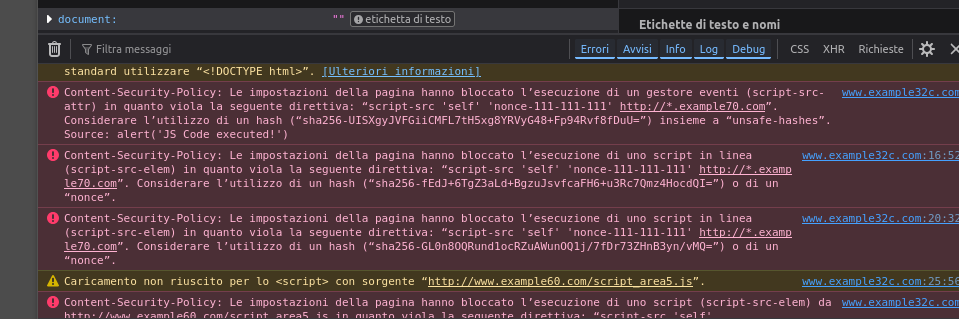
      <br>
      <b>Identificazione Hash (Console)</b>
    </td>
    <td align="center">
      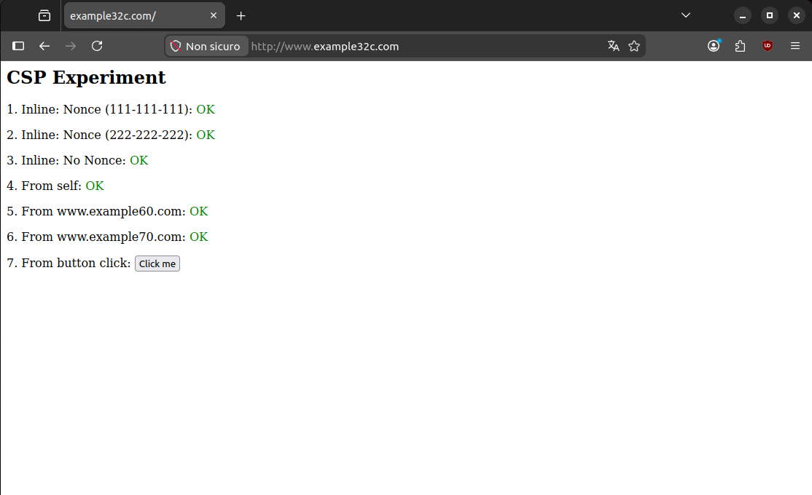
      <br>
      <b>Dopo (example32c - SHA-256)</b>
    </td>
  </tr>
</table>

## 2.3 SQL Injection

Un altra categoria di attacchi ad applicazioni web è rappresentata dall'SQL Injection, ossia dalla possibiltà di poter alterare campi di tabelle di un database nel web facendo ricorso alla sintassi SQL


### 2.3.1 Modify Table

L'obiettivo dell'attacco è di 
1. Aumentare il salario di un utente
2. Diminuire il salario di un secondo utente, e cambiare la sua password.

Il profilo si presenta in questo modo:

<p align="center">
  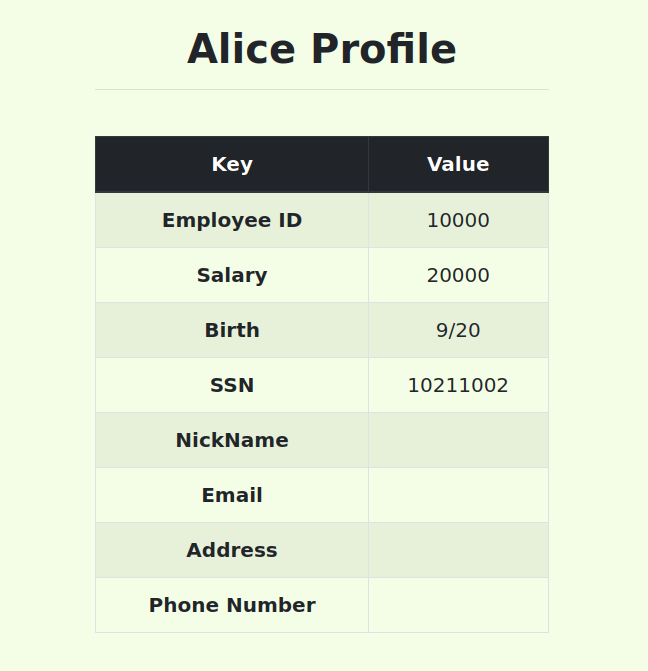
</p>

All'interno del sito è presente una una funzione di modifica, che ci permette di poter modificare solo alcuni campi specifici. Tra questi, non è compreso il salario. Per fare questo, bisogna iniettare il campo del salario, e far sì che il sistema lo interpreti comunque come una query legittima

<p align="center">
  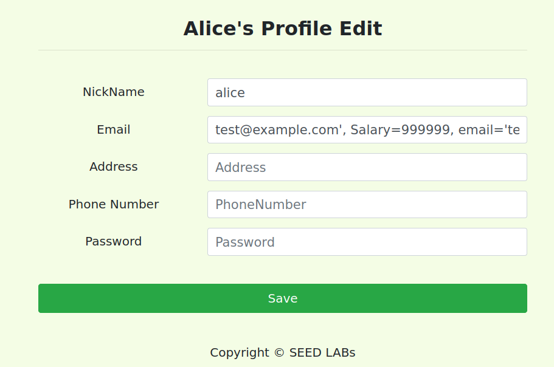
</p>

In questo caso, inseriamo due query

```sql
#1: Aumento di salario
test@example.com', Salary=999999, email='test@example.com


#2: diminuzione di stipendio e cambio di password a Boby
', Salary=1, Password = sha1('bobysucks') WHERE EID=20000 #
```

Per il primo caso, siccome si tratta di una modifica allo stesso profilo, possiamo inserire la modifica in maniera diretta all'interno del campo email. Mentre nel secondo caso, invece, viene aggiunta la condizione `WHERE` al fine di apportare modifiche anche ad altri profili. Si noti l'uso di `#` per commentare il resto della query.

<table align="center">
  <tr>
    <td align="center">
      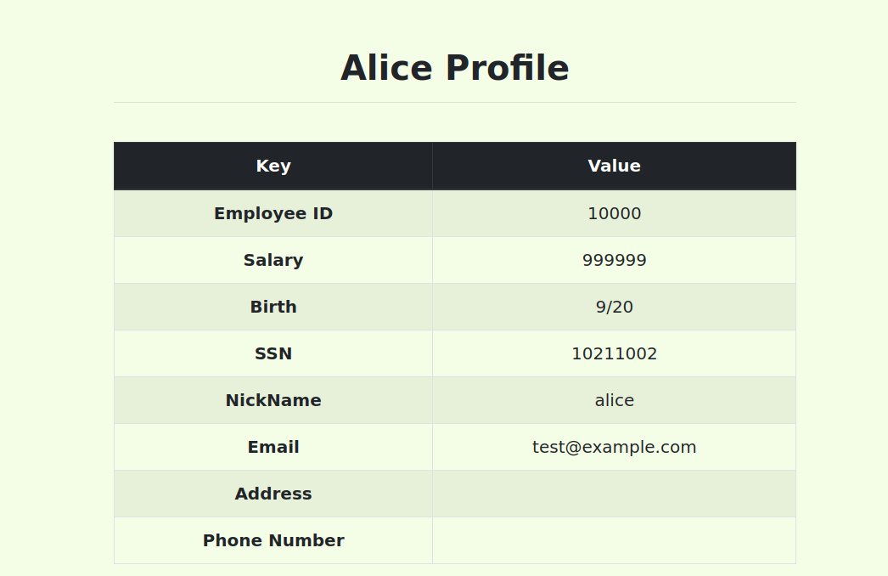
      <br>
      <b>Profilo Alice (Salario aumentato)</b>
    </td>
    <td align="center">
      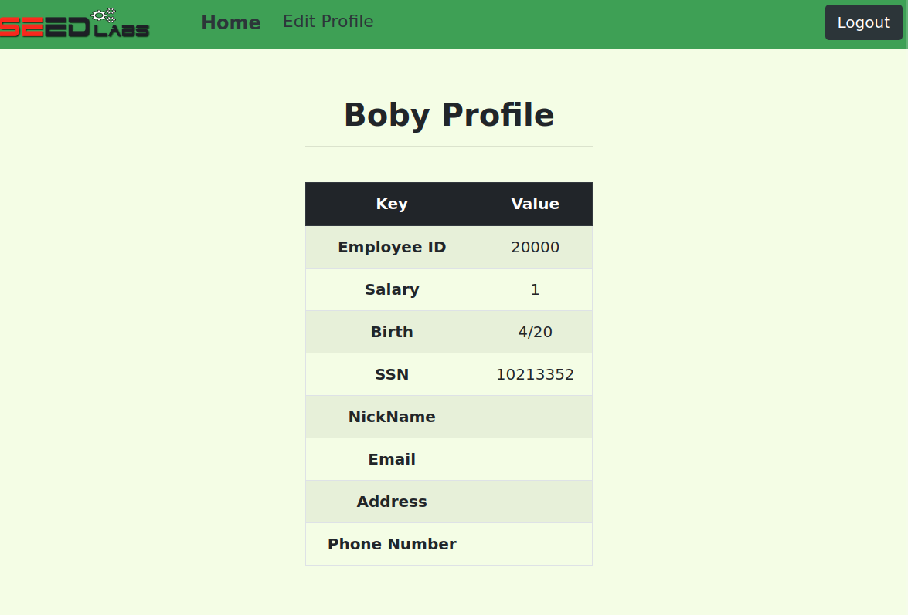
      <br>
      <b>Profilo Boby (Salario ridotto)</b>
    </td>
  </tr>
</table>


### 2.3.2 Prepared Statements

I **Prepared Statements** sono la difesa principale contro l'SQL Injection perché separano la struttura del comando SQL dai dati inseriti dall'utente.

Invece di unire tutto in una singola stringa, il processo avviene in due fasi:
1.  **Template**: Si invia al database lo schema della query usando dei segnaposti (`?`).
    ```sql
    SELECT id, name, eid, salary, ssn FROM credential WHERE name= ? and Password= ?
    ```
2.  **Dati**: I valori (come username o password) vengono inviati separatamente.

Grazie a questa separazione, il database tratta i dati dell'utente esclusivamente come testo. Anche se un attaccante inserisce caratteri speciali (come `'`, `;` o `#`), questi non potranno mai alterare il comando SQL originale.

#### Confronto tecnico: `unsafe.php` vs `prepared_statement.php`

*   **In `unsafe.php`**: La query viene costruita concatenando i dati utente direttamente nella stringa. Questo è vulnerabile perché il database non distingue tra il comando e i dati.
    ```php
    // VULNERABILE: query diretta con variabili concatenate
    $conn->query("... WHERE name= '$input_uname' ...");
    ```
*   **In `prepared_statement.php`**: Viene inviata prima la struttura della query e poi i dati. Il database sa già che i dati in arrivo sono semplici valori letterali.
    ```php
    // SICURO: query preparata con segnaposti
    $stmt = $conn->prepare("... WHERE name= ? ...");
    $stmt->bind_param("s", $input_uname);
    ```


