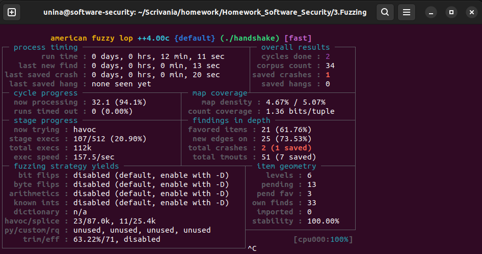
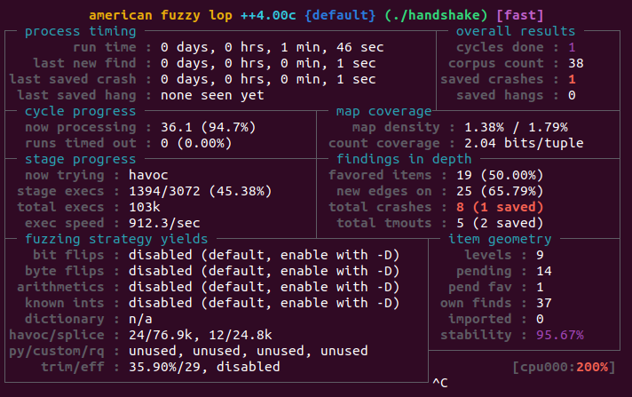
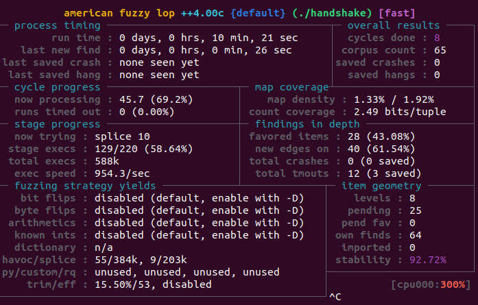

Per eseguire il setup:
CC=afl-clang-fast CXX=afl-clang-fast++ ./config -d -g -no-shared
AFL_USE_ASAN=1 make build_libs

Creazione certificato:
openssl req -x509 -newkey rsa:512 -keyout server.key -out server.pem -days 365 -nodes -subj /CN=a/

Per compilare test_harness:
AFL_USE_ASAN=1 afl-clang-fast++ handshake.cc -o handshake openssl/libssl.a openssl/libcrypto.a -I openssl/include -ldl

è stato creato un file di testo come seed per il fuzzing, per effettuarlo si usa:
afl-fuzz -i input -o output -m none -- ./handshake

Di default, Ubuntu invia i crash a un'app di sistema, ma questa operazione crea un piccolo ritardo. AFL testa migliaia di input al secondo e ha bisogno di rilevare i crash immediatamente. Il seguente comando disattiva la segnalazione di sistema dicendo a Linux di salvare solo un file locale di base (core).
sudo su -c "echo core >/proc/sys/kernel/core_pattern"

Per diagnosticare il bug, eseguiamo il programma dando in ingresso l'input che causa il crash:
./handshake < output/default/crashes/id\:000000\,sig\:06\,src\:000030+000023\,time\:711360\,execs\:109670\,op\:splice\,rep\:2

L'errore rilevato è un heap-buffer-overflow:
==121651==ERROR: AddressSanitizer: heap-buffer-overflow on address 0x629000009748 at pc 0x00000049c767 bp 0x7fffbf3309f0 sp 0x7fffbf3301b8

Il bug si trova nel file t1_lib.c, alla riga 2586, all'interno della funzione tls1_process_heartbeat:
READ of size 48830 at 0x629000009748 thread T0
    #0 0x49c766 in __asan_memcpy (/home/unina/Scrivania/homework/Homework_Software_Security/3.Fuzzing/handshake+0x49c766)
    #1 0x4ded5f in tls1_process_heartbeat /home/unina/software-security/fuzzing/heartbleed/openssl/ssl/t1_lib.c:2586:3
    #2 0x5535da in ssl3_read_bytes /home/unina/software-security/fuzzing/heartbleed/openssl/ssl/s3_pkt.c:1092:4
    #3 0x558139 in ssl3_get_message /home/unina/software-security/fuzzing/heartbleed/openssl/ssl/s3_both.c:457:7
    #4 0x520be0 in ssl3_get_client_hello /home/unina/software-security/fuzzing/heartbleed/openssl/ssl/s3_srvr.c:941:4
    #5 0x51c97e in ssl3_accept /home/unina/software-security/fuzzing/heartbleed/openssl/ssl/s3_srvr.c:357:9
    #6 0x4d1d03 in main /home/unina/Scrivania/homework/Homework_Software_Security/3.Fuzzing/handshake.cc:47:3
    #7 0x7ff2866c3d8f in __libc_start_call_main csu/../sysdeps/nptl/libc_start_call_main.h:58:16
    #8 0x7ff2866c3e3f in __libc_start_main csu/../csu/libc-start.c:392:3
    #9 0x4204c4 in _start (/home/unina/Scrivania/homework/Homework_Software_Security/3.Fuzzing/handshake+0x4204c4)

Il buffer originale, da cui il programma sta cercando di leggere troppi dati, è stato allocato tramite la funzione CRYPTO_malloc all'interno del file mem.c alla riga 308:
0x629000009748 is located 0 bytes to the right of 17736-byte region [0x629000005200,0x629000009748)
allocated by thread T0 here:
    #0 0x49d3ad in malloc (/home/unina/Scrivania/homework/Homework_Software_Security/3.Fuzzing/handshake+0x49d3ad)
    #1 0x58ac89 in CRYPTO_malloc /home/unina/software-security/fuzzing/heartbleed/openssl/crypto/mem.c:308:8

Esecuzione con gdb:
pwndbg> set breakpoint pending on
pwndbg> break __asan::ReportGenericError
Breakpoint 1 at 0x4a28c4
pwndbg> run < output/default/crashes/id:000000,sig:06,src:000030+000023,time:711360,execs:109670,op:splice,rep:2 
pwndbg> backtrace
#0  0x00000000004a28c4 in __asan::ReportGenericError(unsigned long, unsigned long, unsigned long, unsigned long, bool, unsigned long, unsigned int, bool) ()
#1  0x000000000049c786 in __asan_memcpy ()
#2  0x00000000004ded60 in tls1_process_heartbeat (s=<optimized out>, s@entry=0x618000000080) at t1_lib.c:2586
#3  0x00000000005535db in ssl3_read_bytes (s=0x618000000080, type=<optimized out>, buf=<optimized out>, len=<optimized out>, peek=<optimized out>) at s3_pkt.c:1092
#4  0x000000000055813a in ssl3_get_message (s=0x618000000080, st1=8465, stn=8466, mt=1, max=16384, ok=0x7fffffffda00) at s3_both.c:457
#5  0x0000000000520be1 in ssl3_get_client_hello (s=<optimized out>) at s3_srvr.c:941
#6  0x000000000051c97f in ssl3_accept (s=<optimized out>) at s3_srvr.c:357
#7  0x00000000004d1d04 in main () at handshake.cc:47
#8  0x00007ffff7a78d90 in __libc_start_call_main (main=main@entry=0x4d1b90 <main()>, argc=argc@entry=1, argv=argv@entry=0x7fffffffdfa8) at ../sysdeps/nptl/libc_start_call_main.h:58
#9  0x00007ffff7a78e40 in __libc_start_main_impl (main=0x4d1b90 <main()>, argc=1, argv=0x7fffffffdfa8, init=<optimized out>, fini=<optimized out>, rtld_fini=<optimized out>, stack_end=0x7fffffffdf98) at ../csu/libc-start.c:392
#10 0x00000000004204c5 in _start ()
pwndbg> frame 2
#2  0x00000000004ded60 in tls1_process_heartbeat (s=<optimized out>, s@entry=0x618000000080) at t1_lib.c:2586
2586			memcpy(bp, pl, payload);
pwndbg> print/x payload
$1 = 0xbebe

eseguendo hexdump -C output/default/crashes/id:000000,sig:06,src:000030+000023,time:711360,execs:109670,op:splice,rep:2 otteniamo il seguente output:
00000000  18 03 01 00 01 01 01 01  01 01 01 01 01 01 01 01  |................|
00000010  01 01 01 01 01 01 01 01  01 01 01 01 01 01 01 01  |................|
00000020  01 01 01 01 01 01 01 01  01 01 16 03              |............|
0000002c

ciò indica che:
1. Il pacchetto è malformato e troncato: L'intestazione del file generato da AFL dichiara che il record ha una lunghezza di un solo byte (visibile dai byte 00 01 all'offset 0x03). I byte be non sono fisicamente presenti nell'input.

2. Primo out-of-bounds (lettura della lunghezza): Il codice di OpenSSL si aspetta di elaborare 3 byte per il messaggio Heartbeat (1 byte per il tipo, 2 byte per capire la lunghezza del payload). Poiché il record fornisce solo 1 byte reale (01), la funzione di lettura (n2s) tenta di leggere i 2 byte mancanti sconfinando oltre i limiti del record, nella memoria adiacente del server.

3. Innesco del bug (secondo out-of-bounds): Pescando casualmente in quella zona di memoria non inizializzata o sporcata da pattern di debug, OpenSSL legge i byte be e be. Questo valorizza la variabile payload a 0xbebe (48830 in decimale), forzando la successiva memcpy a copiare ed esfiltrare 48830 byte di memoria del server. AFL ha quindi sfruttato un piccolo errore di lettura per generare autonomamente la lunghezza falsa necessaria a innescare Heartbleed.

Per compilare test_harness senza ASAN:
nella cartella openssl:
make clean
make build_libs

nella cartella in cui è presente l'eseguibile:
afl-clang-fast++ handshake.cc -o handshake_no_asan openssl/libssl.a openssl/libcrypto.a -I openssl/include -ldl

rieseguendo senza ASAN e passando in ingresso l'input che causa il crash, il programma termina normalmente, ciò è dovuto a  due fattori principali:
1. La natura del bug: Heartbleed è un bug di natura buffer-overread
che permette una lettura dei dati nel buffer, senza generare eccezioni o crash e continuando a far funzionare il protocollo. Di conseguenza, in mancanza di un controllo specifico il crash non può essere generato.
2. Il funzionamento di ASAN: Durante la fase di instrumentation, ASAN inserisce delle redzones attorno ai buffer, che vengono segnati come "Non accessibili". Nel caso in cui una funzione acceda ad un buffer, Asan genera una specifica eccezione, arrestando il funzionamento del programma.

Per eseguire il comando con valgrind utilizziamo il seguente comando:
valgrind --track-origins=yes ./handshake_no_asan < output/default/crashes/id\:000000\,sig\:06\,src\:000030+000023\,time\:711360\,execs\:109670\,op\:splice\,rep\:2

Eseguendo il programma con valgrind notiamo che:

L'output genera una cascata di errori legati all'uso di memoria non inizializzata:

==127255== Conditional jump or move depends on uninitialised value(s)
==127255==    at 0x45D87E: CRYPTO_malloc (mem.c:300)
==127255==    by 0x40906E: tls1_process_heartbeat (t1_lib.c:2580)
==127255==    by 0x445AA2: ssl3_read_bytes (s3_pkt.c:1092)
==127255==    by 0x44758E: ssl3_get_message (s3_both.c:457)
==127255==    by 0x42D91A: ssl3_get_client_hello (s3_srvr.c:941)
==127255==    by 0x42BAB7: ssl3_accept (s3_srvr.c:357)
==127255==    by 0x403915: main (handshake.cc:47)
==127255==  Uninitialised value was created by a heap allocation
==127255==    at 0x4848899: malloc (in /usr/libexec/valgrind/vgpreload_memcheck-amd64-linux.so)
==127255==    by 0x45D909: CRYPTO_malloc (mem.c:308)
==127255==    by 0x4481A5: freelist_extract (s3_both.c:708)
==127255==    by 0x4481A5: ssl3_setup_read_buffer (s3_both.c:770)
==127255==    by 0x448568: ssl3_setup_buffers (s3_both.c:827)
==127255==    by 0x42D087: ssl3_accept (s3_srvr.c:292)
==127255==    by 0x403915: main (handshake.cc:47)

Valgrind traccia che i dati problematici provengono da un'allocazione nell'heap avvenuta durante la preparazione dei buffer di lettura SSL (ssl3_setup_read_buffer). Questa memoria viene allocata ma popolata solo in minima parte dai byte effettivamente ricevuti dalla rete.
Quando la funzione tls1_process_heartbeat esegue la memcpy fidandosi del parametro contraffatto (falsa lunghezza del payload), finisce per leggere oltre i byte legittimamente scritti, pescando dalla porzione non inizializzata del buffer (o da blocchi adiacenti nell'heap).
Valgrind segnala un'anomalia critica (Use of uninitialised value) nel momento in cui OpenSSL prende questi dati "sporchi" e li elabora attivamente: prima calcolandone l'hash (SHA1_Update), poi copiandoli (memmove) e infine preparandoli per la trasmissione sulla rete (ssl3_write_bytes).

Per utilizzare AFL in persistent mode è necessario modificare il corpo del main() come segue:

int main() {
  static SSL_CTX *sctx = Init();
  __AFL_INIT();

  while(__AFL_LOOP(1000)){
  SSL *server = SSL_new(sctx);
  BIO *sinbio = BIO_new(BIO_s_mem());
  BIO *soutbio = BIO_new(BIO_s_mem());
  SSL_set_bio(server, sinbio, soutbio);
  SSL_set_accept_state(server);

  const int size = 100;
  unsigned char data[size];

  read(0, data, size);

  BIO_write(sinbio, data, size);

  SSL_do_handshake(server);
  SSL_free(server);
  }
  return 0;
}

L'output di AFL in persistent mode è il seguente:

Per migliorare l'efficienza del fuzzer, abbiamo modificato il test harness inserendo il ciclo __AFL_LOOP(1000). Questo permette ad AFL di utilizzare la modalità Persistent Mode, evitando di ricreare un nuovo processo (tramite fork()) per ogni singolo input testato. L'inizializzazione della libreria OpenSSL (Init()) viene così eseguita una sola volta, ammortizzando enormemente i tempi di caricamento.

Confronto delle Prestazioni (entrambi con ASAN abilitato):

Standard Mode:
Come visibile dallo screenshot precedente, il fuzzer si attesta su una velocità di esecuzione di circa 157.5 execs/sec.
Per raggiungere ~112k esecuzioni, AFL ha impiegato più di 12 minuti.

Persistent Mode:
Dallo screenshot, la velocità di esecuzione aumenta a 912.3 execs/sec.
Per raggiungere un numero di esecuzioni comparabile (~103k), AFL ha impiegato appena 1 minuto e 46 secondi.

Conclusioni:
L'introduzione del Persistent Mode ha portato a un incremento del throughput di quasi 6 volte. Questo dimostra come, soprattutto in presenza di target complessi e strumentazione pesante come ASAN, bypassare il context switch e l'overhead del sistema operativo per la creazione dei processi sia fondamentale per trovare crash complessi in tempi rapidi.

FIX Heartbeat
La struttura dati colpita dal bug di Heartbeat è la struttura dati ssl3_record_st usata nella funzione funzione tls1_process_heartbeat nel file t1_lib.c.
Il valore di "length" deve essere maggiore o uguale a (payload_length + 1+2+16). Nella funzione tls1_process_heartbeat non è presente nessun controllo che vada a gestire la grandezza di payload_length.
Per fixare il bug occorre inserire all'inizio della lettura il seguente controllo:
if(s->s3->rrec.length < (payload + 1 + 2 + 16)) return 0;

Come dimostra lo screenshot precedente, dopo aver lasciato in esecuzione il fuzzer in modalità persistente per oltre 10 minuti, il contatore dei "saved crashes" è rimasto a 0. Questo fornisce la prova empirica dell'efficacia della patch: qualsiasi pacchetto Heartbeat malformato generato da AFL (che dichiara un payload superiore ai byte effettivamente inviati) viene intercettato dal nuovo costrutto if e scartato silenziosamente (return 0) prima di raggiungere la memcpy fatale. L'assenza di crash e di avvisi da parte di ASAN conferma la completa e corretta mitigazione della vulnerabilità
