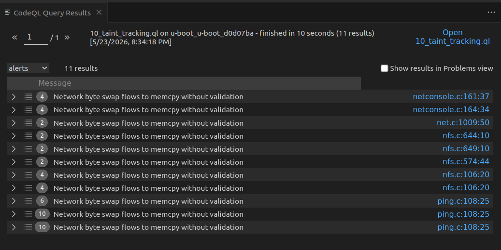

# 4. Static Analysis

L'obiettivo di questa challenge (proposta dal GitHub Security Lab) è testare e migliorare le abilità di *vulnerability hunting* imparando a padroneggiare CodeQL. La missione consiste nel trovare le **13 vulnerabilità critiche di Remote Code Execution (RCE)** scoperte dai ricercatori all'interno del bootloader **U-Boot**. Queste vulnerabilità (identificate dai CVE da CVE-2019-14192 a CVE-2019-14204) si innescano quando U-Boot è configurato per utilizzare la connessione di rete al fine di eseguire il fetching delle risorse di avvio. Il problema di fondo è un potenziale **buffer overflow** controllato dall'attaccante.

Per individuare i bug in modo mirato, la soluzione CodeQL è stata costruita mediante un approccio step-by-step, imparando gradualmente come modellare le chiamate del codice C e filtrando man mano le chiamate non sicure, fino ad arrivare al file decisivo `10_taint_tracking.ql` in cui viene formalizzata l'analisi finale.

---

## 4.1 Il Risultato della Query (`10_taint_tracking.ql`)
La query finale costruita nel decimo step è un'analisi automatica volta a tracciare in modo accurato se i valori provenienti dall'esterno finiscono in chiamate insicure della funzione `memcpy`. 
Nello specifico, utilizzando la libreria `TaintTracking` di CodeQL (un'analisi **path-problem** che mostra visivamente in GitHub il percorso dai dati compromessi all'uso), la query rileva casi in cui:
- **La Sorgente (Source):** Un dato in ingresso controllato dall'attaccante proviene dal network (delineato dai risultati delle macro di conversione byte come `ntohs`, `ntohl`, `ntohll`).
- **Il Pozzo (Sink):** Questo dato finisce direttamente per essere utilizzato come argomento della "dimensione" parametrizzata in una chiamata `memcpy`, indicata tramite `call.getArgument(2)` nel codice.

Se la query traccia con successo l'intero percorso dalla *Sorgente* al *Sink*, solleverà un avviso identificando la fetta di codice fallata e mostrando l'errore: *"Network byte swap flows to memcpy without validation"*.

  

---

## 4.2 Il predicato `isBarrier` per la sanificazione
Durante la costruzione dell'analisi, sorgono facilmente dei *falsi positivi*: cosa succede se lo sviluppatore utilizza i dati in ingresso e chiama la `memcpy`, ma prima effettua un controllo sicuro imponendo limiti massimi di grandezza? 
In questi casi il flusso deve interrompersi per validare l'assenza di vulnerabilità. Questo è compito del predicato `isBarrier(DataFlow::Node node)`:
1. **Controlla un blocco relazionale:** Identifica l'esistenza di una condizione di guardia (es. uno statement `if`) determinata da operatori relazionali (come `<`, `>`, `<=`, `>=`).
2. **Identifica il campo d'azione:** Si assicura che il nodo che CodeQL sta scansionando (la variabile `v` *tainted*) stia venendo richiamato.
3. **Verifica il limite (Bound check):** Constata che a essere verificata da quell'operatore logico/relazionale sia esattamente quella variabile (se si trova a destra o a sinistra dell'operazione, come ad es. `length < MAX_SIZE`).
4. **Isola la via sicura:** Conferma infine che questa guardia tuteli il Basic Block esecutivo nel suo ramo `true`; cioè, l'esecuzione approderà al nodo in cui risiede la *Sink* (la potenziale `memcpy`) unicamente se l'esito della validazione di sicurezza darà esito positivo. In tal modo erige la "barriera", bloccando CodeQL dal segnalarlo come minaccia tra gli eventi di sicurezza.

---

## 4.3 Automazione con GitHub Actions (`main.yml`)
Oltre alla validazione e stesura locale della query, è stato integrato un workflow GitHub Actions in `.github/workflows/main.yml` per un'individuazione trasparente sul repository, simulando un vero applicativo SAST. 

I passaggi principali operati dal virtual environment Ubuntu garantiscono:
- **Trigger event:** Si aziona a ogni singola `push` direttamente sul costrutto `main` (o tramite procedura manuale *dispatch*).
- **Checkout & Environment:** Preleva il codice sorgente e inizializza l'azione nativa `github/codeql-action/init@v3` per analizzare il linguaggio C/C++ (`cpp`), dicendo a CodeQL di focalizzarsi unicamente sulla custom query finale prodotta (`./4.StaticAnalysis/query_github_actions/10_taint_tracking.ql`).
- **Dependency Install & Intercepting Build:** Essendo un linguaggio compilato, CodeQL richiede di "ascoltare e tracciare" l'intera procedura di build del progetto per costruirsi a ritroso il database semantico del codice del progetto. A questo scopo, il workflow installa dipendenze chiave per l'utility, entra nel modulo `u-boot`, lo configura con `make sandbox_defconfig` (creando un'infrastruttura di test) per poi iniziare un massiccio processo di make tracciato.
- **Reporting:** Come step finale, scatta `analyze@v3`. CodeQL sfrutta il database generatosi per eseguire la problem-query, postando gli avvisi localizzati e visibili all'interno della dashboard Security > Code scanning sulla repository di GitHub. 