ANALISI LAB01-01
Analisi virustotal:
Si è calcolato l'hash del file Lab01-01.exe utilizzando SHA256 con il seguente comando di Powershell:
Get-FileHash -Algorithm SHA256 .\Lab01-01.exe 

l'hash calcolato è il seguente:
58898BD42C5BD3BF9B1389F0EEE5B39CD59180E8370EB9EA838A0B327BD6FE47

Risultato della ricerca su virustotal:

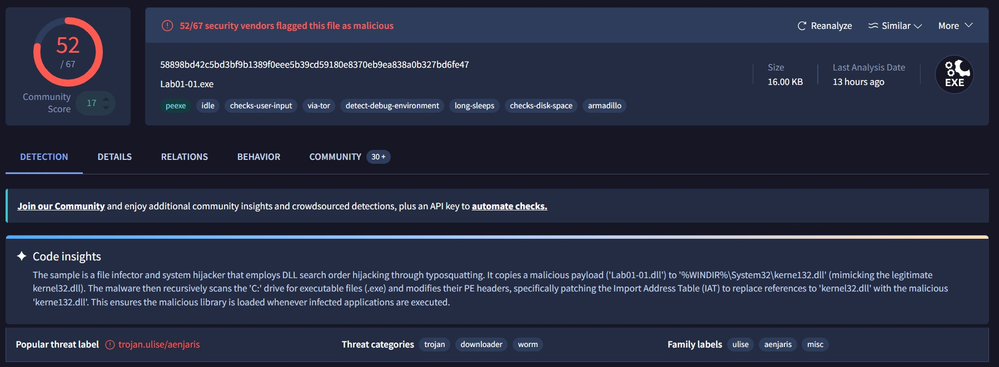

Si è calcolato l'hash del file Lab01-01.dll utilizzando SHA256 con il seguente comando di Powershell:
Get-FileHash -Algorithm SHA256 .\Lab01-01.dll

l'hash calcolato è il seguente:
F50E42C8DFAAB649BDE0398867E930B86C2A599E8DB83B8260393082268F2DBA

Risultato della ricerca su virustotal:

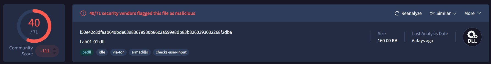

Le indagini rivelano che i due file analizzati non sono minacce isolate, ma operano in stretta sinergia per compromettere il sistema ospite. L'eseguibile agisce come dropper e infettante di sistema. Il suo obiettivo non è rubare dati ma manipolare l'architettura di base del sistema operativo per garantirsi persistenza ed esecuzione invisibile. Per farlo, sfrutta una tecnica di typosquatting applicata alle librerie condivise: installa una DLL malevola assegnandole un nome quasi identico a quello di una libreria critica e legittima di Windows, sperando di eludere i controlli visivi e le verifiche superficiali. Una volta avviato, rastrella il disco rigido alla ricerca di altri programmi sani. Quando ne individua uno, ne altera gli header interni (nello specifico la Import Address Table), modificando i riferimenti di sistema in modo che puntino alla falsa libreria appena creata. In questo modo, l'eseguibile si assicura che il codice malevolo venga innescato automaticamente e ripetutamente ogni volta che l'utente ignaro avvia una delle applicazioni compromesse. La libreria dinamica analizzata rappresenta, di fatto, il payload di questa operazione. Una volta che l'eseguibile ha "avvelenato" i processi legittimi costringendoli a caricarla in memoria, la DLL entra in azione in modo silente. Le analisi comportamentali suggeriscono che questo componente sia protetto da meccanismi di anti-analisi (offuscamento o packing) e sia progettato per operazioni di rete. Vi sono forti indicatori che suggeriscono la capacità di stabilire connessioni esterne furtive, potenzialmente instradando il traffico attraverso reti anonime per comunicare con l'infrastruttura di comando e controllo degli attaccanti.

Analsi PeView:
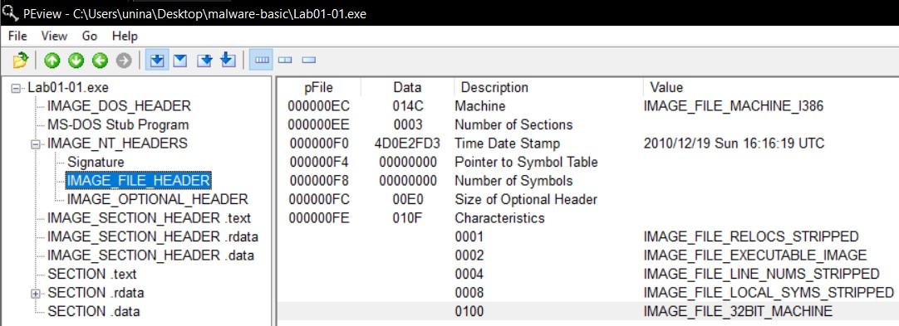

Per comprendere l'origine temporale della minaccia, il campione Lab01-01.exe è stato sottoposto ad analisi strutturale utilizzando PEview, un'utilità progettata per ispezionare gli header dei file PE (Portable Executable).

Navigando all'interno dell'albero delle intestazioni del file, specificamente nel percorso IMAGE_NT_HEADERS > IMAGE_FILE_HEADER, è stato possibile estrarre il marcatore temporale inserito dal compilatore. Il campo Time Date Stamp ha rivelato la seguente informazione critica:

Data e ora di compilazione: 19 Dicembre 2010 alle 16:16:19 UTC.

Valore Esadecimale: 4D0E2FD3.

Analisi PEiD:
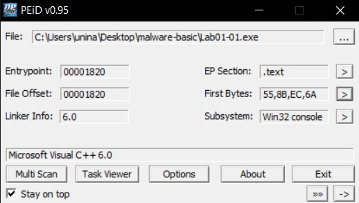

L'esito dell'analisi dimostra che il file non è "packed" né offuscato. Lo strumento, infatti, ha identificato senza alcun ostacolo la firma del compilatore originale, rivelando che il binario è stato generato tramite Microsoft Visual C++ 6.0. Qualora il file fosse stato protetto da un packer, l'output avrebbe riportato la firma di quest'ultimo, mascherando del tutto il compilatore sottostante.

Questa conclusione è ulteriormente supportata dall'analisi dei First Bytes registrati all'Entry Point (55, 8B, EC, 6A). Questi valori esadecimali corrispondono al classico prologo Assembly in architettura x86 per la creazione dello stack frame (es. push ebp, mov ebp, esp).

Analisi BinText:
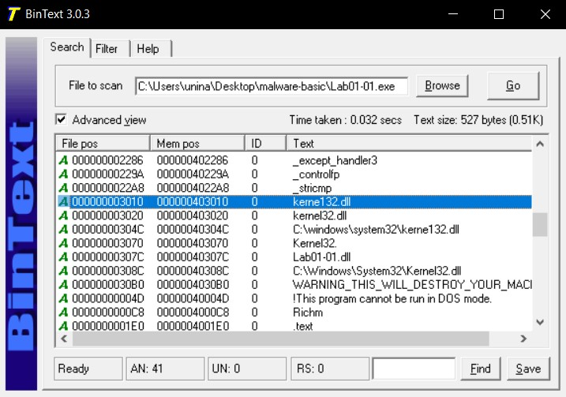

All'interno del codice dell'eseguibile sono state individuate le funzioni di sistema FindFirstFileA, FindNextFileA e CopyFileA. Nel contesto dello sviluppo software per Windows, questa triade di API costituisce il pattern standard per l'esplorazione ricorsiva del file system e la manipolazione dei file. La loro presenza simultanea all'interno di un file classificato come malevolo indica una chiara capacità di scansione a tappeto delle directory dell'ospite, finalizzata alla ricerca di vettori eseguibili e alla successiva sovrascrittura o duplicazione del codice dannoso.

L'ispezione approfondita dei riferimenti alle librerie esterne ha svelato la presenza della stringa kerne132.dll. Si tratta di una tecnica di typosquatting, in cui l'autore del malware ha sostituito il carattere alfabetico "l" con il carattere numerico "1" per imitare la libreria di sistema legittima kernel32.dll.

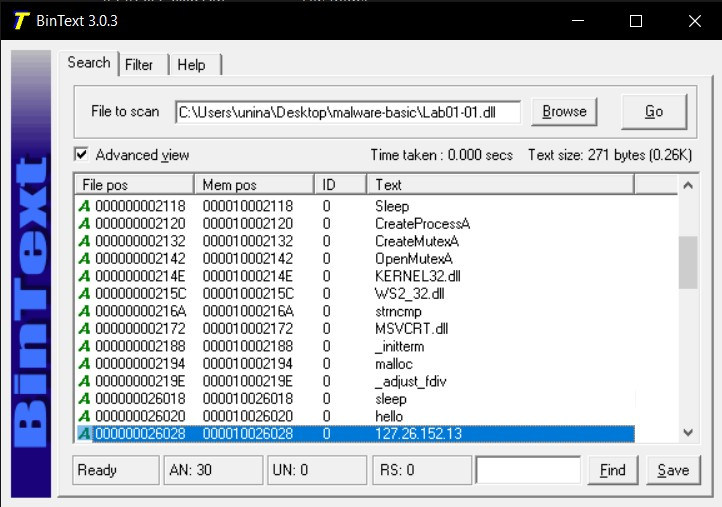

Le stringhe di sistema estratte indicano due funzionalità comportamentali ben precise:  

CreateProcessA: L'intento di questa API in un contesto di rete è l'avvio di un processo figlio. Tipicamente, i malware la utilizzano per generare una shell di comandi (es. cmd.exe) e agganciarne silenziosamente gli stream di input e output a un socket di rete, fornendo all'attaccante un accesso da riga di comando al sistema infetto.

Sleep / sleep: L'inclusione di funzioni per la sospensione dei thread ha solitamente un duplice scopo. Serve come tecnica di evasione (ritardando l'esecuzione per "scadere" il tempo limite delle sandbox di analisi) e per gestire il beaconing, ovvero per distanziare temporalmente i ripetuti tentativi di connessione verso il server remoto, rendendo il traffico meno sospetto.

È stato estratto l'indirizzo IP in chiaro 127.26.152.13, l'appartenenza di questo IP alla subnet di loopback (127.0.0.0/8) indica che questa specifica build del malware è probabilmente una versione di test, configurata dall'autore per connettersi a un server in esecuzione sulla sua stessa macchina locale.  

hello non è un comando di sistema, ma il dato testuale che la DLL invia attraverso la rete. Funge da messaggio iniziale di handshake o segnale di vita. 

Analisi DependencyWalker:

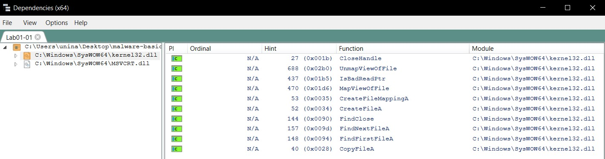

L'analisi dell'eseguibile Lab01-01.exe tramite l'utility Dependencies ha permesso di validare gli indizi raccolti in precedenza durante l'estrazione delle stringhe.
Esaminando la Import Address Table, e in particolar modo le funzioni importate dalla libreria di base KERNEL32.DLL, è stata confermata la presenza di chiamate dirette alle seguenti API: FindFirstFileA, FindNextFileA e CopyFileA.
La presenza effettiva di queste funzioni tra le importazioni legittime del file certifica che l'eseguibile possiede i requisiti tecnici per interagire con il file system, ricercare altri file eseguibili e replicarsi o sovrascrivere dati.

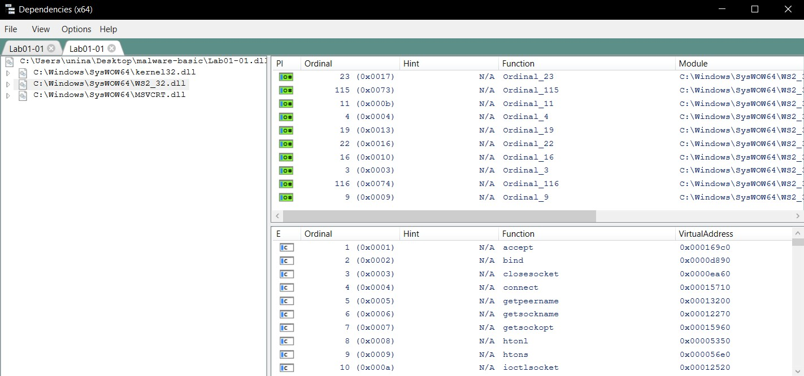

Tra le dipendenze primarie spicca l'importazione di WS2_32.DLL. Questa libreria espone le API di Windows Sockets (Winsock), confermando in via definitiva che il modulo è progettato per la gestione di connessioni di rete (creazione di socket TCP/UDP).
Un aspetto tecnicamente rilevante è l'utilizzo della tecnica del Linking by Ordinal: il malware non importa le funzioni di rete chiamandole per nome (es. connect, send), ma utilizzando unicamente il loro identificativo numerico (l'ordinale). Questa è una tecnica di base per ostacolare l'analisi statica e nascondere la firma comportamentale del file.

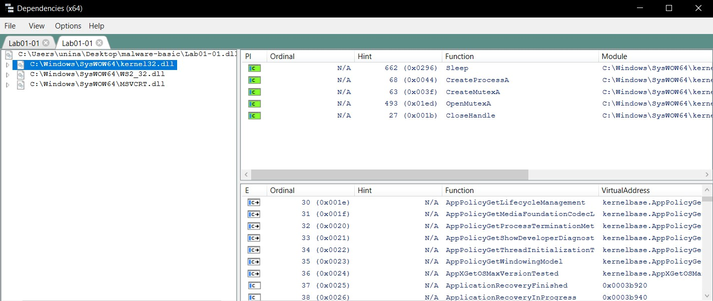
Oltre alle API Sleep e CreateProcessA, è stata individuata la funzione CreateMutexA (insieme a OpenMutexA).  L'utilizzo di un Mutex (Mutual Exclusion object) indica che il malware implementa un meccanismo di controllo della concorrenza. Questa tecnica viene impiegata dal payload per verificare se il sistema è già stato compromesso, evitando così di eseguire istanze multiple di se stesso sulla medesima macchina infetta.

ANALISI LAB01-04
Analisi virustotal:
Si è calcolato l'hash del file Lab01-04.exe utilizzando SHA256 con il seguente comando di Powershell:
Get-FileHash -Algorithm SHA256 .\Lab01-04.exe

l'hash calcolato è il seguente:
0FA1498340FCA6C562CFA389AD3E93395F44C72FD128D7BA08579A69AAF3B126

Risultato della ricerca su virustotal:

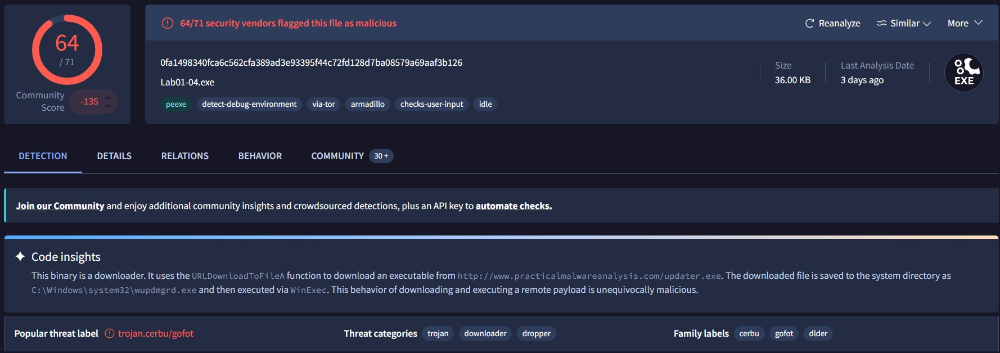

Il file risulta altamente compromesso, con un tasso di rilevamento critico (64 motori antivirus su 71 lo classificano come minaccia). I tag associati al file, come detect-debug-environment e armadillo, indicano la presenza di tecniche di anti-analisi e offuscamento progettate per ostacolare l'ingegneria inversa.

La categorizzazione principale del malware è quella di Downloader / Dropper. Il suo scopo non è infliggere un danno diretto, ma fungere da "testa di ponte" per scaricare e installare ulteriori moduli malevoli sul sistema della vittima.

Analsi PeView:
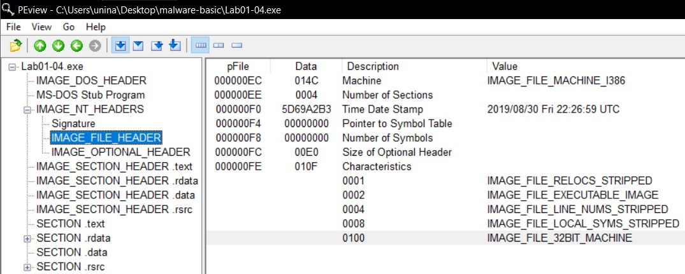

Navigando all'interno dell'albero delle intestazioni del file, specificamente nel percorso IMAGE_NT_HEADERS > IMAGE_FILE_HEADER, è stato possibile estrarre il marcatore temporale inserito dal compilatore. Il campo Time Date Stamp ha rivelato la seguente informazione critica:

Data e ora di compilazione: 30 Agosto 2019 alle 22:26:59 UTC.

Valore Esadecimale: 5D69A2B3.

Analisi PEiD:
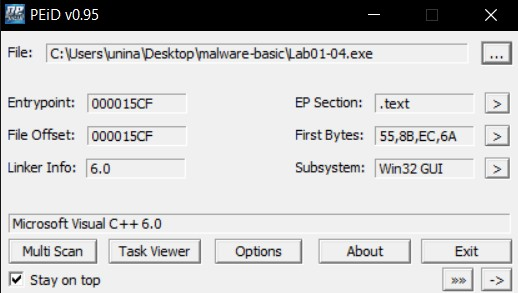

L'esito dell'analisi dimostra che il file non è "packed" né offuscato. Lo strumento, infatti, ha identificato senza alcun ostacolo la firma del compilatore originale, rivelando che il binario è stato generato tramite Microsoft Visual C++ 6.0. Qualora il file fosse stato protetto da un packer, l'output avrebbe riportato la firma di quest'ultimo, mascherando del tutto il compilatore sottostante.

Questa conclusione è ulteriormente supportata dall'analisi dei First Bytes registrati all'Entry Point (55, 8B, EC, 6A). Questi valori esadecimali corrispondono al classico prologo Assembly in architettura x86 per la creazione dello stack frame (es. push ebp, mov ebp, esp).

Analisi BinText:
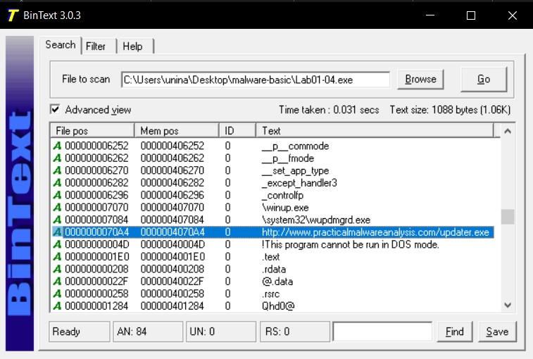

All'offset 0000000070A4, evidenziato nello screenshot, è stata individuata la URL completa che il downloader tenta di contattare: http://www.practicalmalwareanalysis.com/updater.exe. Il nome esatto del payload remoto scaricato dal dominio è updater.exe.  È inoltre interessante notare la presenza delle stringhe adiacenti, come \system32\wupdmgrd.exe e \winup.exe. Queste stringhe confermano la strategia di occultamento del malware, che rinomina il file appena scaricato per farlo somigliare a un legittimo programma di aggiornamento di Windows, nel tentativo di eludere i controlli visivi.

Analisi DependencyWalker:

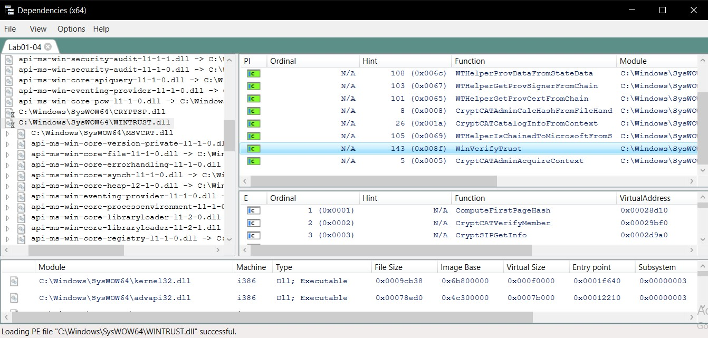

Selezionando il modulo WINTRUST.dll dall'albero delle dipendenze, l'elenco delle funzioni importate ha rivelato la presenza dell'API WinVerifyTrust (evidenziata nello screenshot).
Da un punto di vista analitico, WinVerifyTrust è una funzione di sistema che viene utilizzata per eseguire controlli sulle firme digitali (trust verification). In un contesto malevolo, la sua presenza suggerisce che il downloader potrebbe effettuare controlli sui moduli che scarica per assicurarsi che non siano stati alterati, oppure potrebbe tentare di manipolare e aggirare i meccanismi di validazione della sicurezza del sistema operativo prima di avviare il payload.

ANALISI KEYLOGGER

Analisi PEview:
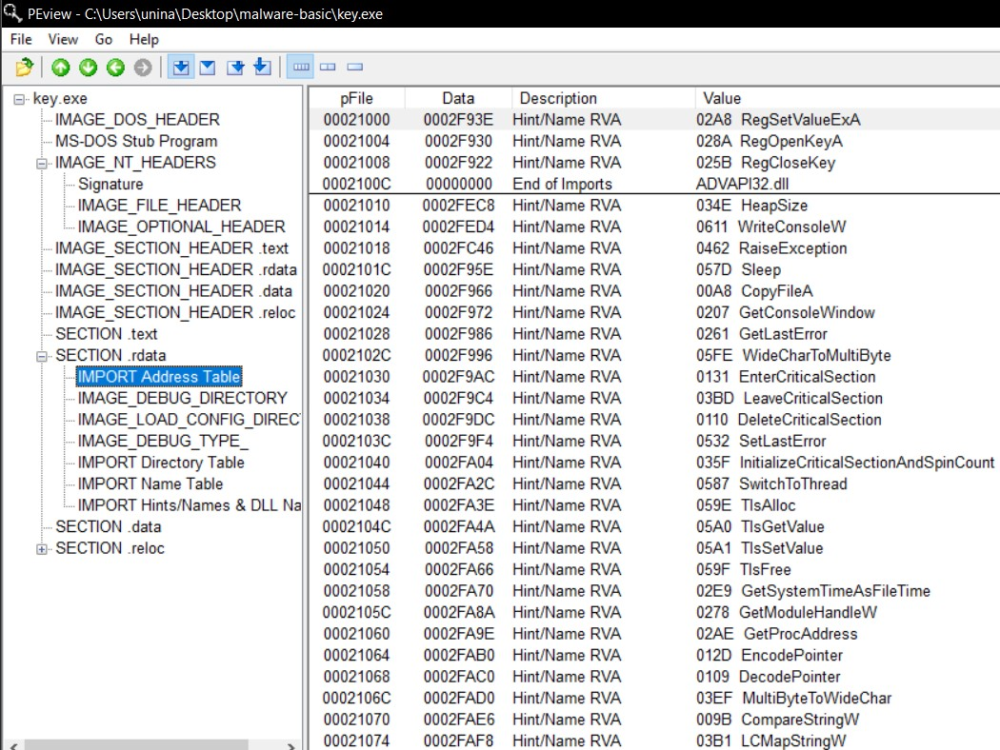

L'analisi della Import Address Table (IAT) tramite PEview ha evidenziato l'utilizzo di librerie di sistema strettamente legate ad attività malevole classiche:

Manipolazione del Registro: L'importazione delle API RegSetValueExA e RegOpenKeyA (tramite la libreria ADVAPI32.dll) è un chiaro indicatore che il malware tenterà di interagire con il registro di sistema di Windows. Questo comportamento è quasi sempre finalizzato alla creazione di una chiave di persistenza (Run Key) per garantirsi l'esecuzione automatica all'avvio della macchina.

Replicazione: La presenza della funzione CopyFileA suggerisce che l'eseguibile non opererà esclusivamente dalla sua posizione originale, ma cercherà di clonarsi in un'altra directory del file system.

Analisi binText:
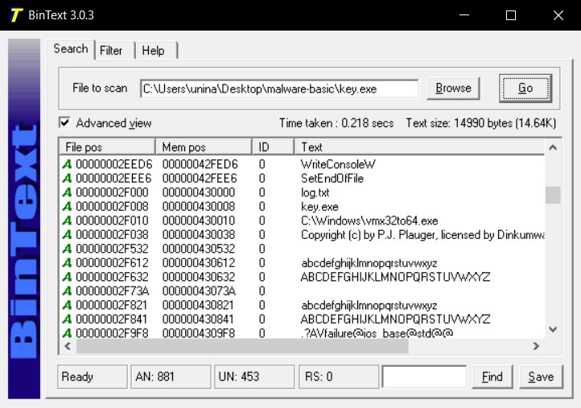

L'estrazione delle stringhe in chiaro ha confermato le ipotesi formulate ispezionando la IAT, rivelando i dettagli operativi del malware:

È stata individuata la stringa C:\Windows\vmx32to64.exe posizionata in stretta prossimità della stringa key.exe. Questo indica che il malware utilizzerà l'API CopyFileA (precedentemente individuata) per installare una copia di se stesso all'interno della directory di sistema protetta, rinominandosi per mimetizzarsi come un legittimo componente per macchine virtuali (VMware).

La stringa log.txt rappresenta con altissima probabilità il file di output all'interno del quale il malware salverà clandestinamente le battiture intercettate dalla tastiera della vittima.

L'ispezione ha rivelato lunghe sequenze alfabetiche come abcdefghijklmnopqrstuvwxyz e le rispettive versioni in maiuscolo. In un contesto di sviluppo software malevolo, queste non rappresentano codice "spazzatura" (padding) per alterare l'hash del file, bensì sono elementi strutturali vitali per un keylogger. Fungono da tabelle di conversione che il programma utilizza per tradurre i codici numerici grezzi inviati dalla tastiera al sistema operativo (Virtual-Key Codes) in caratteri testuali comprensibili da salvare nel file di log. (Le stringhe limitrofe come .?AVfailure@ios_base@std@@ sono invece normali artefatti RTTI generati dal compilatore C++).

ANALISI DINAMICA
Analisi dell'Esecuzione con Process Explorer:

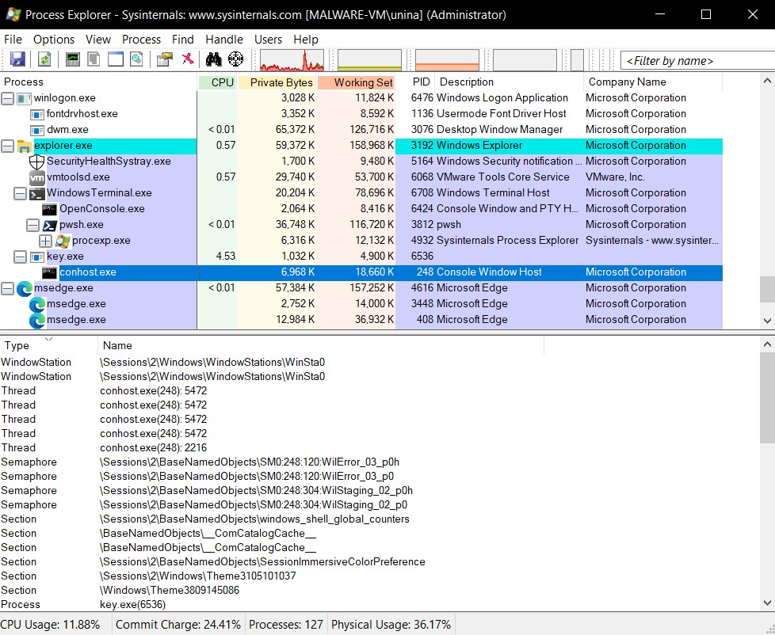

L'analisi dinamica del campione key.exe è stata avviata eseguendo il file con privilegi di amministratore in un ambiente isolato. L'osservazione iniziale tramite Process Explorer ha confermato l'avvio con successo del processo. L'ispezione del pannello inferiore rivela le risorse allocate dal malware per interfacciarsi con il sistema operativo, gettando le basi per l'individuazione di indicatori di compromissione in memoria, come la creazione di oggetti di sincronizzazione per evitare l'esecuzione di istanze multiple.

Analisi Comportamentale con Process Monitor:

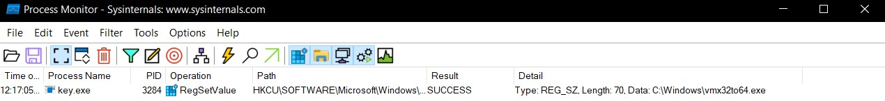

Parallelamente, Process Monitor ha registrato in tempo reale l'attività del malware sul file system. I filtri applicati hanno rivelato un'attività continua e ciclica: le numerose operazioni di CreateFile, WriteFile e CloseFile documentano la natura di keylogger del malware, mentre scrive i dati intercettati all'interno del file log.txt nella directory di lavoro.

Identificazione della Persistenza:

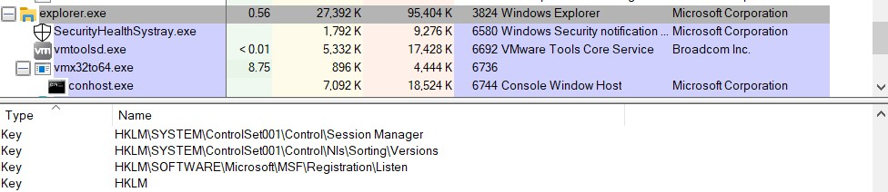

Per individuare il meccanismo di persistenza, i filtri di ProcMon sono stati calibrati sull'operazione RegSetValue. Questa indagine ha permesso di catturare il momento esatto in cui il malware si è garantito l'avvio automatico, effettuando una scrittura mirata all'interno della chiave di autostart (Run Key) relativa all'utente corrente.

Il percorso esatto della chiave creata dal malware è HKCU\SOFTWARE\Microsoft\Windows\CurrentVersion\Run\vmx32to64. L'operazione conferma in via definitiva l'esito dell'analisi statica: il valore inserito nel registro punta all'eseguibile "copia" C:\Windows\vmx32to64.exe, garantendo che il sistema operativo stesso richiami il codice malevolo in modo furtivo ad ogni login dell'utente.

Verifica dell'Esfiltrazione Dati:

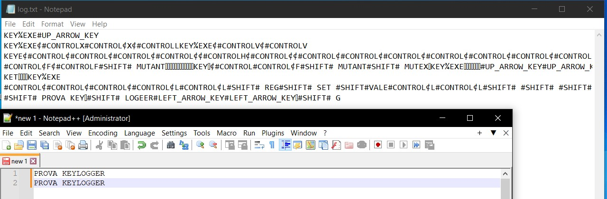

Per validare empiricamente le capacità di spionaggio del malware, è stato condotto un test pratico digitando diverse stringhe di testo all'interno di un editor di testo, per poi ispezionare il file di output generato dall'eseguibile. L'apertura del file log.txt conferma l'assoluta pericolosità della minaccia: il keylogger registra tutto in chiaro. È particolarmente rilevante notare dal log come il malware sia in grado di tracciare non solo i caratteri alfanumerici, ma anche i codici dei tasti speciali utilizzati dalla vittima (come #SHIFT#, #UP_ARROW_KEY# e #CONTROL#), dimostrando un hooking profondo a livello di sistema operativo.

Test di Persistenza Post-Riavvio:

Per verificare l'efficacia dell'infezione, la macchina virtuale è stata riavviata, simulando la normale attività di un utente. L'analisi dei processi post-riavvio tramite Process Explorer dimostra il successo dell'attacco: il malware si è avviato automaticamente in background. Tuttavia, il processo non si chiama più key.exe, bensì vmx32to64.exe. Questo conferma che il sistema è ora infetto tramite la copia residente nella directory di sistema C:\Windows, la quale è perfettamente in grado di mimetizzarsi tra i servizi legittimi.

Remediation e Bonifica del Sistema:

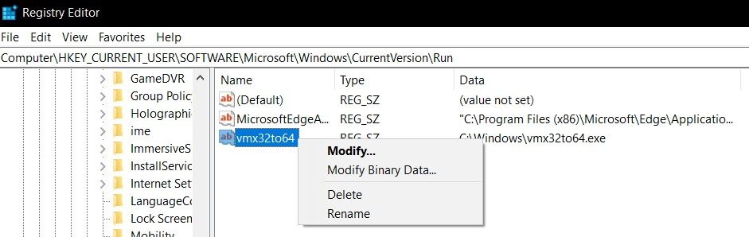

L'ultima fase del laboratorio ha simulato l'attività di Incident Response, con l'obiettivo di neutralizzare la minaccia. Utilizzando l'Editor del Registro di Sistema (regedit.exe), l'analista ha navigato fino al percorso di autostart compromesso.

L'ispezione delle proprietà della voce vmx32to64 ha confermato che la tipologia di dato utilizzata nel registro per questa chiave è REG_SZ (String Value). Per disinnescare la minaccia, la chiave è stata eliminata definitivamente dal sistema operativo. Con questa operazione di bonifica, la catena di esecuzione automatica è interrotta: pur rimanendo il file binario inerte sul disco rigido, il keylogger non si avvierà più ai successivi riavvii della macchina.

ANALISI key12.exe

Analisi dell'Esecuzione e Persistenza (Process Monitor):

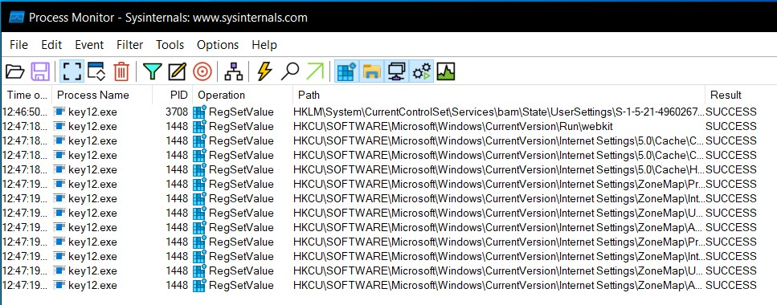

La variante key12.exe è stata sottoposta ad analisi dinamica seguendo la medesima metodologia adottata per il campione originale. L'intercettazione degli eventi tramite Process Monitor, filtrata per le operazioni di tipo RegSetValue, ha rivelato un comportamento analogo in termini di persistenza, ma con indicatori di compromissione differenti.

Mentre il campione precedente creava una chiave denominata vmx32to64, questa specifica variante tenta di mascherare il proprio meccanismo di autostart inserendo nel registro la voce webkit all'interno del percorso HKCU\SOFTWARE\Microsoft\Windows\CurrentVersion\Run. La registrazione di questo evento conferma l'intento del malware di sopravvivere ai riavvii di sistema, mimetizzandosi come un componente legato all'omonimo motore di rendering del browser.

Analisi del Traffico di Rete:

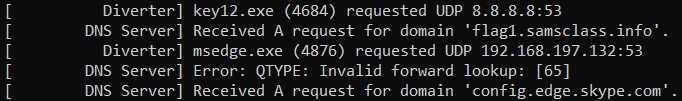

L'evoluzione più significativa di questa variante risiede nelle sue capacità di comunicazione esterna. Per isolare e analizzare questo comportamento senza esporre la rete reale, il malware è stato eseguito all'interno di un ambiente controllato simulato tramite l'utility FakeNet.

L'intercettazione del traffico in uscita ha rivelato l'immediato tentativo del processo key12.exe di risolvere un indirizzo IP, interrogando i server DNS pubblici. Il dominio richiesto dal malware è flag1.samsclass.info.

Intercettazione Esfiltrazione Dati::

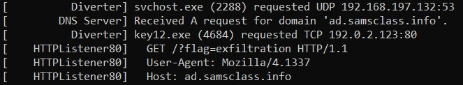

Subito dopo aver ottenuto la risoluzione del nome a dominio (fornita fittiziamente da FakeNet), il malware ha instaurato una connessione TCP sulla porta 80 verso l'infrastruttura di attacco.

L'ispezione dei pacchetti HTTP catturati ha permesso di documentare l'esatta sintassi utilizzata per la comunicazione: il keylogger ha effettuato una richiesta HTTP di tipo GET. La risorsa specifica richiesta al server è /?flag=exfiltration.

Questa evidenza dimostra che la variante key12.exe non si limita a memorizzare le battiture in locale, ma tenta attivamente di esfiltrare i dati spiati verso un server controllato dall'attaccante. È inoltre di particolare interesse analitico notare l'header HTTP associato alla richiesta: il malware tenta di mascherare il proprio traffico utilizzando l'User-Agent anomalo Mozilla/4.1337, un chiaro indicatore di compromissione a livello di rete (dove "1337" è un noto riferimento al gergo "leet" hacker).

ANALISI CAPA
Analisi Lab01-01.exe:

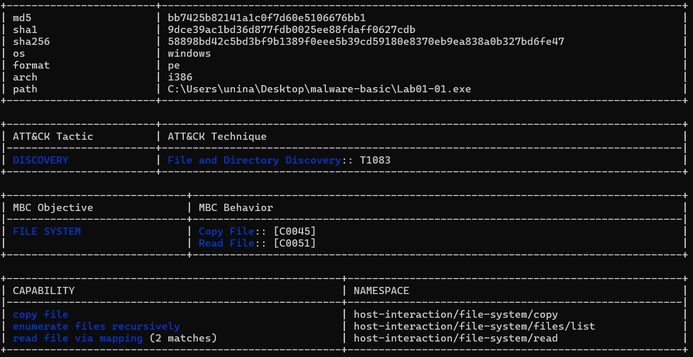

Lo strumento ha mappato autonomamente il comportamento del file sulla matrice MITRE ATT&CK, identificando la tattica primaria DISCOVERY e la tecnica File and Directory Discovery (T1083). Analizzando la sezione delle Capabilities a basso livello, spiccano le voci enumerate files recursively e copy file. Questo convalida la natura di "file infector" del malware, progettato per scansionare in modo ricorsivo l'intero disco rigido alla ricerca di eseguibili target da sovrascrivere o affiancare con codice malevolo.

Di particolare rilevanza è l'identificazione della capability read file via mapping. Questo indica che il malware non utilizza le standard API di lettura sequenziale, ma mappa i file target direttamente in memoria RAM (File Mapping). Questa è una tecnica sofisticata utilizzata per analizzare e manipolare le strutture interne degli eseguibili (come gli header PE e la IAT) in modo rapido ed efficiente prima di procedere all'infezione.

Analisi Capa: Lab01-01.dll

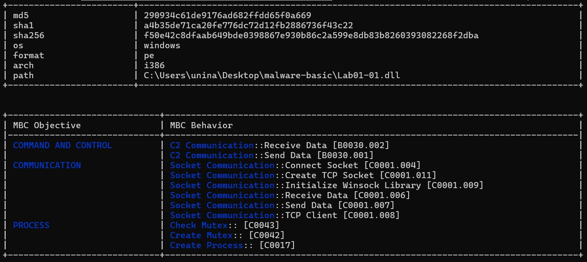
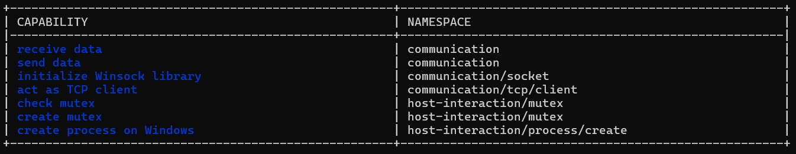

L'esecuzione di Capa sulla libreria dinamica ha delineato il suo ruolo come payload attivo (backdoor/impianto di rete). Gli obiettivi catalogati nel framework MBC (Malware Behavior Catalog) etichettano esplicitamente il modulo per attività di COMMAND AND CONTROL e COMMUNICATION.

Le Capabilities estratte dimostrano che la libreria è in grado di inizializzare lo stack di rete Windows (initialize Winsock library), agire come client diretto (act as TCP client) e gestire flussi bidirezionali di informazioni (send data, receive data).

Inoltre, il tool rileva la gestione della concorrenza tramite Mutex (check mutex, create mutex), confermando che il payload verifica di essere l'unica istanza in esecuzione sul sistema infetto. Infine, la capacità create process on Windows rappresenta l'anello finale della catena di compromissione: la backdoor è progettata per eseguire comandi remoti forniti dall'attaccante, molto probabilmente istanziando una shell nascosta sul computer della vittima.

Analisi Capa: Lab01-04.exe

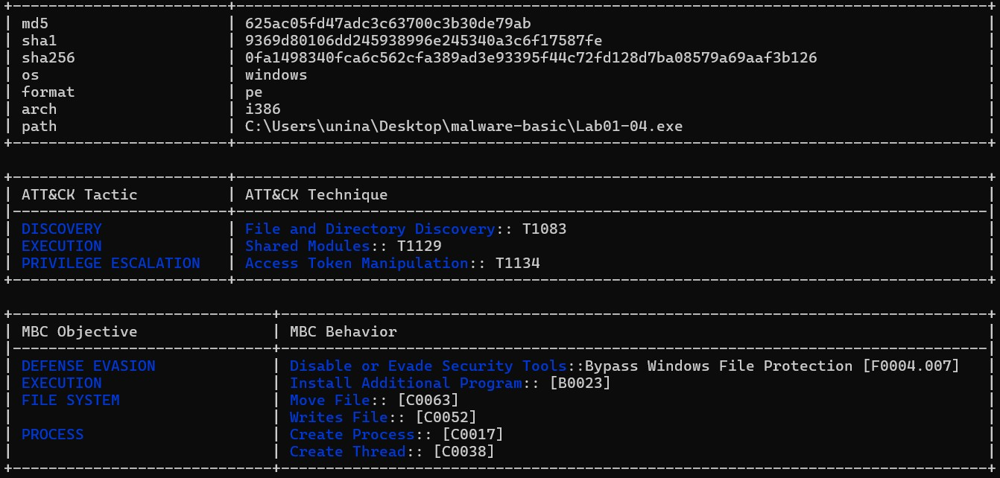

Tra le tattiche MITRE ATT&CK individuate, oltre all'Esecuzione, emerge la PRIVILEGE ESCALATION tramite la manipolazione dei token di accesso (T1134).

L'ispezione delle Capabilities svela l'esatto meccanismo di delivery dell'infezione. Il programma non scarica il payload da Internet, ma lo nasconde cifrato o compresso al proprio interno, all'interno della sezione risorse PE (contain a resource (.rsrc) section, contain an embedded PE file). Durante l'esecuzione, il malware provvede a spacchettarlo ed estrarlo in memoria (extract resource via kernel32 functions).

Il malware è programmato per aggirare le difese integrate del sistema operativo (bypass Windows File Protection) innalzare i propri permessi per interagire con la memoria di altri programmi (acquire debug privileges).

Infine, per ostacolare le attività di analisi statica e nascondere la propria IAT agli analisti, il dropper non dichiara palesemente tutte le API di cui necessita. Al contrario, risolve e carica le funzioni critiche dinamicamente solo nel momento del bisogno (link function at runtime on Windows).
